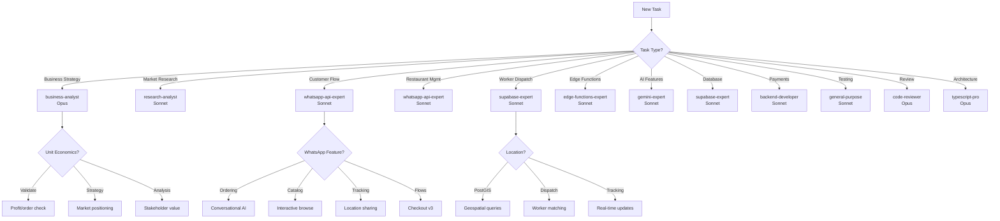

# Agent Delegation Matrix

**Project**: Weats - Disruptive WhatsApp AI Food Delivery Platform
**Framework**: CLAUDE-MASTER v4.0
**Last Updated**: 2025-01-11

---

## Agent Selection Strategy

### Model Economics
- **Claude Sonnet 4**: $3 per 1M input tokens, $15 per 1M output tokens
- **Claude Opus 4.1**: $15 per 1M input tokens, $75 per 1M output tokens
- **Cost Ratio**: Opus is 5x more expensive

**General Rule**: Use Sonnet for routine tasks, Opus for complex architecture/design/strategy

---

## Delegation Matrix

| Task Category | Agent | Model | Rationale | Trigger Keywords |
|--------------|-------|-------|-----------|-----------------|
| **Business Strategy** | business-analyst | Opus | Unit economics critical for food delivery | "unit economics", "profitability", "market strategy", "stakeholder analysis" |
| **Market Research** | research-analyst | Sonnet | Competition and market intelligence | "competition", "market", "Rappi", "research", "analysis" |
| **WhatsApp Integration** | whatsapp-api-expert | Sonnet | WhatsApp API patterns well-documented | "whatsapp", "interactive message", "flows", "webhook", "media message" |
| **Edge Functions** | edge-functions-expert | Sonnet | Edge Runtime patterns established | "edge function", "edge runtime", "vercel edge", "cold start", "bundle size" |
| **Database** | supabase-expert | Sonnet | Food delivery schema (orders, restaurants) | "supabase", "postgres", "postgis", "pgvector", "schema", "migration" |
| **Gemini Integration** | gemini-expert | Sonnet | Free tier optimization critical | "gemini", "free tier", "function calling", "conversational AI" |
| **AI/ML Features** | ai-engineer | Opus | LLM integration complex | "OpenAI", "RAG", "embeddings", "streaming", "AI optimization" |
| **TypeScript Architecture** | typescript-pro | Opus | Complex type systems need deep reasoning | "type safety", "generics", "architecture", "refactor" |
| **Frontend** | frontend-developer | Sonnet | UI work mostly routine | "React", "component", "UI", "admin dashboard", "analytics" |
| **Backend API** | backend-developer | Sonnet | CRUD operations standard | "API", "endpoint", "route", "order processing", "dispatch" |
| **Testing** | general-purpose | Sonnet | Test writing mostly mechanical | "test", "spec", "coverage", "jest" |
| **Code Review** | code-reviewer | Opus | Deep analysis required | "/review", "security", "vulnerability", "production readiness" |
| **Documentation** | api-documenter | Sonnet | API docs generation automated | "API documentation", "OpenAPI", "endpoints" |

---

## Phase 1 MVP: Week-by-Week Agent Allocation

**Reference**: `docs/implementation/DELEGATION-PLAN.md`

**Total**: 250 engineering hours over 4 weeks

| Week | Primary Agent | Hours (%) | Secondary Agent | Hours (%) | Support Agents | Hours |
|------|--------------|-----------|----------------|-----------|----------------|-------|
| **Week 1: Foundation** | supabase-expert | 48h (80%) | edge-functions-expert | 12h (20%) | code-reviewer: 4h<br>general-purpose: 8h | **72h total** |
| **Week 2: Ordering** | gemini-expert | 42h (60%) | whatsapp-api-expert | 28h (40%) | business-analyst: 6h<br>general-purpose: 12h | **88h total** |
| **Week 3: Supply** | whatsapp-api-expert | 32.5h (50%) | supabase-expert | 19.5h (30%) | gemini-expert: 13h<br>general-purpose: 10h | **75h total** |
| **Week 4: Launch** | backend-developer | 33h (60%) | business-analyst | 22h (40%) | code-reviewer: 8h<br>general-purpose: 12h | **75h total** |

### Week 1: Foundation (Database + Webhook) - 72 hours

**supabase-expert** (48h - 80%):
- Database schema (10 tables) - 10h
- PostGIS functions (3 functions) - 12h
- pgvector setup + HNSW index - 8h
- RLS policies (multi-tenant) - 8h
- Migration files (8-10 migrations) - 10h

**edge-functions-expert** (12h - 20%):
- WhatsApp webhook handler - 8h
- Signature validation + fire-and-forget - 4h

**code-reviewer** (4h):
- RLS policy review - 2h
- Webhook security audit - 2h

**general-purpose** (8h):
- Database integration tests - 4h
- Webhook integration tests - 4h

**Gate 1**: Technical Lead approval required

---

### Week 2: Customer Experience (Ordering Flow) - 88 hours

**gemini-expert** (42h - 60%):
- Gemini API client wrapper - 8h
- **BUG-P0-001 FIX** (Supabase tracking) - 4h **[CRITICAL]**
- System prompt implementation - 6h
- Context management - 6h
- Gemini tools (5 tools) - 12h
- Error handling + fallback - 6h

**whatsapp-api-expert** (28h - 40%):
- Interactive message templates - 12h
- 24h window optimization - 8h
- Restaurant order notifications - 8h

**business-analyst** (6h):
- Cost tracking per order - 3h
- Unit economics validation - 3h

**general-purpose** (12h):
- Gemini agent unit tests - 8h
- Ordering flow integration tests - 4h

**Gate 2**: PM + Technical Lead approval required

---

### Week 3: Supply Side (Restaurant/Worker) - 75 hours

**whatsapp-api-expert** (32.5h - 50%):
- Restaurant onboarding flow - 12h
- Worker notification design - 8h
- Order acceptance/rejection logic - 6h
- QR code system - 6.5h

**supabase-expert** (19.5h - 30%):
- Optimize find_best_worker query - 6h
- Real-time worker assignment - 8h
- Timeout + reassignment logic - 5.5h

**gemini-expert** (13h - 20%):
- Menu extraction (Gemini Vision) - 8h
- Business info extraction - 5h

**general-purpose** (10h):
- Restaurant onboarding E2E tests - 4h
- Dispatch algorithm unit tests - 6h

**Gate 3**: Operations Lead approval required

---

### Week 4: Payments + Launch - 75 hours

**backend-developer** (33h - 60%):
- Stripe integration - 12h
- WhatsApp Flows v3 checkout - 8h
- Stripe webhook handler - 8h
- Failed payment recovery - 5h

**business-analyst** (22h - 40%):
- Cost tracking dashboard design - 8h
- Implement cost tracking queries - 6h
- Gemini usage tracking dashboard - 4h
- Launch execution planning - 4h

**code-reviewer** (8h):
- Security audit (production) - 4h
- Performance review - 4h

**general-purpose** (12h):
- Payment flow E2E tests - 6h
- Stripe webhook tests - 6h

**Gate 4**: CEO + CFO GO/NO-GO decision

---

### Cross-Cutting Agents (All Weeks)

**general-purpose** (20h continuous):
- Test writing (unit + integration + E2E)
- Documentation updates
- Bug fixes (minor issues)
- Code cleanup + refactoring

**ui-visual-validator** (8h weekly reviews):
- Week 2: WhatsApp message design validation
- Week 3: Restaurant onboarding UX validation
- Week 4: Dashboard UI validation

---

## Task-Specific Delegation

### Weats Feature Development

#### Customer Ordering Flow
**Agent**: `whatsapp-api-expert` (Sonnet)
**Reason**: WhatsApp-native conversational interface
**Scope**:
- Conversational ordering via Gemini AI
- Interactive catalogs for restaurant browse
- Button menus for cart management
- Order confirmation messages
- Real-time tracking updates

**Delegation Command**:
```
/task whatsapp-api-expert "Implement conversational food ordering flow: customer discovery → restaurant browse → menu selection → cart → checkout → confirmation. Use Gemini for AI, interactive catalogs for browsing, buttons for actions."
```

---

#### Restaurant Management via WhatsApp
**Agent**: `whatsapp-api-expert` (Sonnet)
**Reason**: WhatsApp-based business dashboard
**Scope**:
- 30-second onboarding flow
- Conversational menu management (AI-powered)
- Order notification system (accept/reject)
- Mark order ready for pickup
- Daily analytics via WhatsApp

**Delegation Command**:
```
/task whatsapp-api-expert "Implement restaurant management via WhatsApp: onboarding flow, conversational menu management with Gemini AI, order notifications with buttons (accept/reject), ready-for-pickup confirmation."
```

---

#### Worker Dispatch System
**Agent**: `supabase-expert` (Sonnet) + `whatsapp-api-expert` (Sonnet)
**Reason**: Complex geospatial queries + WhatsApp notifications
**Scope**:
- PostGIS location-based matching
- Optimal worker assignment algorithm (distance + availability)
- Order assignment notifications via WhatsApp
- Pickup/delivery confirmation (QR codes)
- Real-time earnings tracking

**Delegation Command**:
```
/task supabase-expert "Implement worker dispatch algorithm using PostGIS: find_best_worker() function that matches orders to workers based on location (restaurant → customer), availability, and current capacity. Optimize for <10ms queries."

/task whatsapp-api-expert "Implement worker WhatsApp interface: order assignment notifications with details, accept/reject buttons, navigation link, pickup confirmation (QR scan), delivery confirmation, real-time earnings display."
```

---

#### Payment Integration
**Agent**: `backend-developer` (Sonnet)
**Reason**: Standard Stripe integration
**Scope**:
- Stripe payment processing
- WhatsApp Flows checkout (v3)
- Payment confirmation webhooks
- Failed payment handling
- Refund processing

**Delegation Command**:
```
/task backend-developer "Implement Stripe payment integration for Weats: WhatsApp Flows checkout, payment confirmation webhooks, failed payment recovery, refund processing API. Edge Runtime compatible, <3s processing time target."
```

---

#### AI-Powered Features
**Agent**: `gemini-expert` (Sonnet)
**Reason**: Gemini free tier optimization critical for profitability
**Scope**:
- Conversational food ordering (Colombian Spanish)
- Menu search and recommendations
- Customer support automation (90% target)
- Restaurant analytics insights
- Order validation and upselling

**Delegation Command**:
```
/task gemini-expert "Implement Weats AI features with Gemini 2.5 Flash FREE tier: conversational ordering (Colombian Spanish), menu search, recommendations, customer support (90% automation), upselling. Stay within 1,400 req/day, implement tools: search_restaurants, get_menu, create_order, track_delivery, customer_support."
```

---

#### Unit Economics Validation
**Agent**: `business-analyst` (Opus)
**Reason**: Critical business decision-making
**Scope**:
- Cost tracking per order ($0.89 target)
- Revenue optimization (8.4% take rate)
- Profitability analysis ($0.86 profit/order)
- Stakeholder value validation
- Break-even calculations

**Delegation Command**:
```
/task business-analyst "Validate Weats unit economics: track operational costs per order (WhatsApp, AI, delivery, infra), revenue per order (restaurant commission), profit margin. Ensure $0.86 profit/order target met. Identify cost optimization opportunities. Validate against Rappi competitive position."
```

---

#### Competitive Intelligence
**Agent**: `research-analyst` (Sonnet)
**Reason**: Market research and competition analysis
**Scope**:
- Rappi model updates tracking
- Colombian market dynamics
- Competitor moves (iFood, Uber Eats, DiDi Food)
- Regulatory changes
- Customer/restaurant/worker sentiment

**Delegation Command**:
```
/task research-analyst "Monitor Rappi and Colombian food delivery market: track commission changes, worker relations, regulatory updates, expansion plans. Identify competitive advantages to exploit and vulnerabilities to defend. Update competitive intelligence docs weekly."
```

---

#### Database Schema Design
**Agent**: `supabase-expert` (Sonnet)
**Reason**: Food delivery requires specialized schema
**Scope**:
- 10-table schema (customers, restaurants, menu_items, orders, order_items, deliveries, delivery_workers, payments, conversations, messages)
- PostGIS for location queries
- pgvector for menu search
- RLS policies for data isolation
- Performance indexes

**Delegation Command**:
```
/task supabase-expert "Design Weats database schema: 10 core tables with relationships, PostGIS for location queries (<10ms), pgvector for menu search, RLS policies for multi-tenant isolation, indexes for performance. Create migrations and seed data for testing."
```

---

#### WhatsApp Flows for Checkout
**Agent**: `whatsapp-api-expert` (Sonnet)
**Reason**: WhatsApp Flows v3 specialist
**Scope**:
- Multi-step checkout flow
- Cart review screen
- Delivery address selection
- Payment method selection
- Order confirmation

**Delegation Command**:
```
/task whatsapp-api-expert "Implement WhatsApp Flows v3 for Weats checkout: cart review, delivery address selection (saved addresses + new), payment method selection (saved cards + new), order summary, confirmation. Use data exchange endpoint for dynamic pricing, address validation."
```

---

#### Real-Time Order Tracking
**Agent**: `whatsapp-api-expert` (Sonnet) + `supabase-expert` (Sonnet)
**Reason**: WhatsApp location sharing + real-time updates
**Scope**:
- Location sharing from worker to customer
- Real-time status updates (preparing → ready → picked up → en route → delivered)
- ETA calculations
- Push notifications via WhatsApp

**Delegation Command**:
```
/task whatsapp-api-expert "Implement real-time order tracking via WhatsApp: location sharing from worker, status updates, ETA display. Use template messages outside 24h window (minimize cost)."

/task supabase-expert "Implement real-time order tracking infrastructure: Supabase real-time subscriptions on deliveries table, current_lat/current_lng updates, ETA calculation function, status change triggers."
```

---

### Code Quality & Deployment

#### Pre-Deployment Code Review
**Agent**: `code-reviewer` (Opus)
**Reason**: Production readiness critical for marketplace
**Scope**:
- Security vulnerability scan
- Payment security audit (PCI compliance)
- Performance optimization review
- Edge Runtime compatibility check
- Unit economics validation
- Cost tracking accuracy

**Delegation Command**:
```
/task code-reviewer "Review Weats MVP for production readiness: security vulnerabilities (especially payments), performance optimization, Edge Runtime compatibility, cost tracking accuracy ($0.89/order target). Validate unit economics maintained, identify risks."
```

---

#### Unit Testing
**Agent**: `general-purpose` (Sonnet)
**Reason**: Test writing mostly mechanical
**Scope**:
- Order processing tests
- Dispatch algorithm tests
- Payment flow tests
- WhatsApp webhook tests
- AI integration tests

**Delegation Command**:
```
/task general-purpose "Write comprehensive unit tests for Weats MVP: order processing, dispatch algorithm, payment flows, WhatsApp webhooks, AI integration (Gemini). Use Jest + Edge Runtime test setup. Target >80% coverage."
```

---

### Architecture & Strategy

#### System Architecture Design
**Agent**: `business-analyst` (Opus) + `typescript-pro` (Opus)
**Reason**: Business model + technical architecture alignment
**Scope**:
- Three-sided marketplace architecture
- Unit economics enforcement in code
- Scalability planning (10K → 100K → 1M orders/month)
- Cost optimization strategies
- Revenue stream implementation

**Delegation Command**:
```
/task business-analyst "Design Weats marketplace architecture: three-sided model (restaurants/customers/workers), unit economics enforcement ($0.86 profit/order), revenue stream implementation (commission, premium features, data insights), scalability plan. Validate against business model docs."

/task typescript-pro "Design type-safe Weats architecture: marketplace abstractions (supply/demand/logistics), order lifecycle state machine, payment processing types, location types (PostGIS), AI integration interfaces. Enforce unit economics in type system."
```

---

#### Go-to-Market Strategy
**Agent**: `business-analyst` (Opus)
**Reason**: Strategic business planning
**Scope**:
- Bogotá beachhead strategy
- Restaurant acquisition plan (50 → 500 → 2,000)
- Customer acquisition (CAC $12 target)
- Worker recruitment
- Viral growth mechanics

**Delegation Command**:
```
/task business-analyst "Develop Weats go-to-market strategy: Bogotá launch plan (Zona T + Chicó), restaurant acquisition tactics (50 initial), customer acquisition (viral growth, CAC $12), worker recruitment (20 → 200 → 1,000). 16-week roadmap with milestones."
```

---

## Parallel Execution Strategy

### When to Run Agents in Parallel
Use parallel execution when tasks are **independent** and can be completed simultaneously.

**Example: Weats MVP Development**
```
# Run 3 agents in parallel (independent tasks)
/task supabase-expert "Design database schema (10 tables, PostGIS, pgvector)"
/task whatsapp-api-expert "Implement customer ordering flow (discovery → checkout)"
/task gemini-expert "Implement AI conversational interface (Colombian Spanish)"
```

**Benefits**:
- Faster completion (3x speed)
- Independent task isolation
- Parallel testing

**Caution**: Don't parallelize dependent tasks (e.g., payment tests require payment implementation)

---

### Sequential Execution
Use sequential when tasks have **dependencies**.

**Example: Feature Launch Pipeline**
```
1. /task business-analyst "Validate unit economics for new feature"
2. Wait for approval (must be profitable)
3. /task backend-developer "Implement feature"
4. Wait for implementation
5. /task code-reviewer "Review feature code"
6. Wait for review approval
7. /task general-purpose "Deploy to production"
```

---

## Cost Optimization

### Session Budget Allocation
**Target**: <$0.50 per task (average)

**Sonnet Tasks**: $0.10-0.20 per task
- WhatsApp integration
- Database queries
- Unit tests
- Documentation

**Opus Tasks**: $0.30-0.80 per task
- Business strategy
- Architecture design
- Security review
- Complex refactoring

### Monthly Budget
**Total**: ~$60/month for development
- 200 Sonnet tasks @ $0.15 avg = $30.00
- 40 Opus tasks @ $0.50 avg = $20.00
- Research/analysis = $10.00
- **Total**: $60/month ✅ (aligned with lean startup budget)

---

## Decision Tree



---

## Agent Specializations

### business-analyst (Opus) **[NEW]**
**Expertise**:
- Unit economics analysis and optimization
- Three-sided marketplace strategy
- Stakeholder value proposition
- Go-to-market planning
- Competitive intelligence
- Revenue stream design
- Profitability validation

**Use For**:
- Validating $0.86 profit/order target
- Restaurant commission optimization (5-10%)
- Worker pay structure (50-100% higher than Rappi)
- Customer pricing strategy ($0 fees)
- Break-even analysis (1,598 orders/day)
- Market entry strategy (Bogotá → Multi-city)
- Competitive positioning vs Rappi

**Avoid For**:
- Technical implementation
- Code reviews
- Database design

---

### research-analyst (Sonnet) **[NEW]**
**Expertise**:
- Food delivery market research
- Competitive intelligence (Rappi, Uber Eats, iFood, DiDi Food)
- Colombian market dynamics
- Regulatory monitoring
- Customer/restaurant/worker sentiment analysis
- Pricing trends
- Technology trends

**Use For**:
- Rappi model tracking (commissions, worker pay, expansions)
- Competitor moves analysis
- Market opportunity validation
- Regulatory risk assessment
- Customer feedback analysis
- Restaurant pain points research
- Worker sentiment monitoring

**Avoid For**:
- Strategic decision-making (use business-analyst)
- Technical research (use specialized agents)

---

### whatsapp-api-expert (Sonnet)
**Expertise**:
- WhatsApp Business API v23.0 (Cloud API)
- Interactive messages (buttons, lists, reactions, catalogs)
- WhatsApp Flows v3 (navigate and data exchange modes)
- Webhook processing (5s timeout, signature validation)
- Media handling (audio, images, documents)
- Template messages and broadcasts
- Rate limiting (250 msg/sec) and retry strategies
- 24h messaging window optimization

**Use For (Weats-specific)**:
- Customer ordering flow (conversational, catalogs, buttons)
- Restaurant management interface (menu mgmt, order notifications)
- Worker dispatch interface (order assignment, confirmations)
- Real-time tracking (location sharing, status updates)
- Payment flows (WhatsApp Flows checkout)
- Customer support (automated, AI-powered)

**Avoid For**:
- Edge Runtime optimization (use edge-functions-expert)
- AI/ML integration (use gemini-expert or ai-engineer)
- Database design (use supabase-expert)

---

### gemini-expert (Sonnet)
**Expertise**:
- Gemini 2.5 Flash FREE tier optimization (1,400 req/day)
- Conversational AI (Colombian Spanish)
- Function calling (5 tools for Weats)
- Context caching (75% cost savings)
- Multi-modal (text, images, audio)
- Edge Runtime integration

**Use For (Weats-specific)**:
- Conversational food ordering ("Quiero tacos picantes bajo $10")
- Menu search and recommendations
- Customer support automation (90% target)
- Restaurant menu parsing (PDF/images → structured data)
- Order validation and upselling
- Worker dispatch optimization (AI-powered matching)

**Avoid For**:
- Complex RAG systems (use ai-engineer)
- Non-Gemini providers (use ai-engineer)

---

### supabase-expert (Sonnet)
**Expertise**:
- PostgreSQL 15.8 optimization
- PostGIS for geospatial queries (<10ms)
- pgvector for semantic search
- Row Level Security (RLS) for multi-tenant
- Real-time subscriptions
- Custom functions and triggers
- Edge Runtime compatibility

**Use For (Weats-specific)**:
- Database schema design (10 tables: customers, restaurants, menu_items, orders, order_items, deliveries, delivery_workers, payments, conversations, messages)
- Location-based queries (find_nearby_restaurants, find_best_worker)
- Menu search with pgvector
- Real-time order tracking (Supabase real-time)
- Payment transaction management
- Worker availability tracking

**Avoid For**:
- WhatsApp integration (use whatsapp-api-expert)
- Business logic (use backend-developer)

---

### edge-functions-expert (Sonnet)
**Expertise**:
- Vercel Edge Functions
- Edge Runtime APIs (Web APIs, Web Crypto)
- Performance optimization (cold start <200ms, bundle size <1.5MB)
- Streaming responses (SSE, ReadableStream)
- Node.js to Edge migration
- WhatsApp webhook optimization (5s timeout)
- Fire-and-forget patterns

**Use For**:
- WhatsApp webhook optimization (<100ms TTFB)
- Payment webhook handling
- Order processing pipeline
- Real-time notifications
- Cold start optimization
- Bundle size reduction

**Avoid For**:
- WhatsApp API features (use whatsapp-api-expert)
- Database schema (use supabase-expert)

---

### ai-engineer (Opus)
**Expertise**:
- OpenAI API integration (GPT-4o, Whisper, Embeddings)
- RAG systems (vector search, chunking, retrieval)
- Streaming implementations
- LLM prompt engineering
- Edge Runtime ML optimizations
- Multi-provider orchestration

**Use For**:
- Complex AI features (beyond Gemini capabilities)
- RAG for menu search optimization
- Audio transcription (Groq Whisper)
- Streaming responses
- AI cost optimization
- Provider fallback strategies

**Avoid For**:
- Simple Gemini integrations (use gemini-expert)
- WhatsApp features (use whatsapp-api-expert)

---

### code-reviewer (Opus)
**Expertise**:
- Security vulnerability detection
- Payment security (PCI compliance)
- Performance optimization
- Production readiness checks
- Unit economics validation in code
- Cost tracking accuracy

**Use For (Weats-specific)**:
- Payment flow security audit
- Order processing review
- Dispatch algorithm validation
- Cost tracking code review
- Production deployment checklist
- Unit economics enforcement validation

**Avoid For**:
- Routine code changes
- Simple bug fixes

---

## Escalation Rules

### When to Escalate to Opus

1. **Business Critical Decisions**
   - Unit economics validation
   - Market entry strategy
   - Revenue model changes
   - Stakeholder value shifts

2. **Complexity Threshold Exceeded**
   - Task requires >2 hours of Sonnet time
   - Multiple Sonnet attempts failed
   - Architecture decision needed

3. **High-Impact Changes**
   - Payment processing (PCI compliance)
   - Database schema migrations
   - API breaking changes
   - Production deployment blockers

4. **Deep Reasoning Required**
   - Complex marketplace dynamics
   - Multi-sided network effects
   - Algorithm optimization (dispatch)
   - Cost optimization strategies

### When to Downgrade to Sonnet

1. **Implementation After Strategy**
   - Business strategy decided → implement features
   - Architecture designed → build components
   - Following established patterns

2. **Low-Risk Changes**
   - Documentation updates
   - Test additions
   - UI tweaks
   - Configuration changes

---

## Session Management

### Handoff Protocol
When delegating to an agent, provide:

1. **Clear Objective**: What needs to be done
2. **Weats Context**: Reference to business model, unit economics
3. **Constraints**: Cost targets, performance requirements
4. **Success Criteria**: Profit/order maintained, feature works
5. **Files to Focus**: Specific file paths

**Example Handoff (Weats)**:
```
/task whatsapp-api-expert "
Objective: Implement customer food ordering flow via WhatsApp

Weats Context:
- Target $0.03 WhatsApp cost per order (3% of $0.89 operational budget)
- Use 24h messaging windows for 90%+ free messages
- Colombian Spanish (Bogotá market)
- Conversational AI with Gemini (stay within 1,400 req/day)

Constraints:
- <3s order placement time (discovery → confirmation)
- <$0.03 WhatsApp cost per order
- 90%+ messages within free 24h window
- Edge Runtime compatible (Vercel)

Success Criteria:
- Customer can order food in 30 seconds (conversational)
- Interactive catalogs for restaurant browse
- Order confirmation with tracking link
- Unit economics maintained ($0.86 profit/order)
- Tests passing

Files:
- app/api/whatsapp/webhook/route.ts (webhook handler)
- lib/order-processing.ts (create)
- lib/gemini-agents.ts (add food ordering tools)
- tests/whatsapp/ordering-flow.test.ts (create)
"
```

---

## Best Practices

### DO
✅ Use Sonnet for routine implementation (80% of work)
✅ Reserve Opus for strategy and architecture (20% of work)
✅ **Validate all decisions against unit economics ($0.86 profit/order)**
✅ **Prioritize cost optimization (Gemini FREE, WhatsApp 24h window)**
✅ Provide clear context and constraints
✅ Checkpoint before major delegations
✅ Run independent tasks in parallel
✅ Review agent output before merging

### DON'T
❌ Use Opus for simple implementation (waste of budget)
❌ Skip unit economics validation (profitability critical)
❌ Delegate without cost targets (must maintain $0.89 operational cost)
❌ Skip Weats context (agents need business model understanding)
❌ Delegate without clear success criteria
❌ Run dependent tasks in parallel
❌ Skip checkpoints on critical changes
❌ Blindly trust agent output (always review)

---

## Metrics & Optimization

### Track Delegation Success
- Agent selection accuracy (right agent for task)
- First-time success rate (no retries needed)
- Cost per task (vs budget)
- **Unit economics maintained** (critical for Weats)
- Time to completion
- Code quality of output

### Monthly Review
- Adjust delegation rules based on outcomes
- Update cost estimates
- Refine agent descriptions
- Add new agents if needed (e.g., marketing-specialist, operations-manager)

---

**Version**: 2.0 (Updated with Phase 1 MVP allocation)
**Last Updated**: 2025-01-11
**Next Review**: After each weekly approval gate
**Owner**: claude-master
**Project**: Weats - Disruptive WhatsApp AI Food Delivery Platform
**Economics**: $0.86 profit/order (34% margin), validate in every delegation
**Phase 1 Status**: Ready for Week 1 execution (Database + Webhook)
