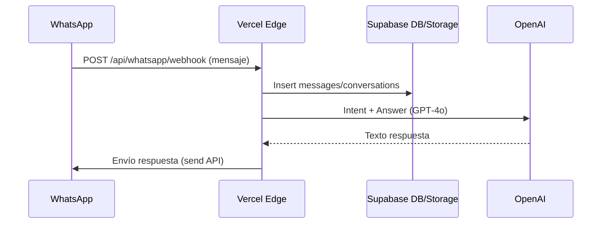

# Arquitectura Técnica (Fullstack) – migue.ai

Arquitectura objetivo: WhatsApp Business API → Vercel Edge Functions → Supabase (DB/Auth/Storage) → OpenAI (GPT‑4o/Whisper/Embeddings)

## 1. Componentes
- WhatsApp Business API (Meta): recepción (webhook) y envío de mensajes.
- Vercel Edge Functions: 
  - `api/whatsapp/webhook` (validación, normalización, orquestación)
  - `api/whatsapp/send` (envío y manejo de reintentos)
  - `api/ai/*` (intent/answer/transcribe)
  - `api/documents/*` (upload/ingest)
  - `api/reminders/*` y Cron `/api/cron/check-reminders`
- Supabase: PostgreSQL (RLS + índices), Auth (opcional), Storage (audio/docs).
- OpenAI: GPT‑4o (chat/intent/answer), Whisper (audio), Embeddings (RAG).

## 2. Flujos Principales

Audio (transcripción): WA → EDGE (descarga media) → Storage → Whisper → respuesta resumida.

RAG PDFs: Upload/ingest → Storage + Embeddings → Retrieval (topK≤5) → GPT‑4o con contexto → respuesta con citas.

Recordatorios: Cron → DB `reminders` vencidos → send → actualización de estado.

## 3. Endpoints (Edge Routing)
- `POST /api/whatsapp/webhook`  Validación firma/token, normalización payload.
- `POST /api/whatsapp/send`     Envío y reintentos (exponencial/backoff). 
- `POST /api/ai/intent`         Clasificación de intención (timeout bajo).
- `POST /api/ai/answer`         Respuestas con o sin contexto RAG.
- `POST /api/ai/transcribe`     Transcripción Whisper (es → en fallback).
- `POST /api/documents/upload`  Subida a Storage; metadatos en DB.
- `POST /api/documents/ingest`  Chunking + embeddings + persistencia.
- `POST /api/reminders/schedule` Crear/actualizar recordatorios.
- `GET  /api/reminders`         Listado/paginado.
- `GET  /api/conversations/:id/messages` Paginado para auditoría.
- `GET  /api/health`            Salud básica (deps y envs requeridos).

Cron (Vercel): `*/1 * * * *` → `/api/cron/check-reminders`.

## 4. Modelo de Datos (Supabase)
- `users(id, phone_number unique, name, preferences jsonb, created_at)`
- `conversations(id, user_id fk, wa_conversation_id, status, created_at)`
- `messages(id, conversation_id fk, direction, type, content, media_url, wa_message_id, timestamp, created_at)`
- `reminders(id, user_id fk, title, description, scheduled_time timestamptz, status, created_at)`
- `documents(id, user_id fk, bucket, path, metadata jsonb, created_at)`
- `embeddings(id, document_id fk, chunk_index, vector, metadata jsonb)`

RLS: por `user_id` (y `customer_id` si multi-tenant posterior). Índices por `conversation_id`, `scheduled_time`, `document_id`.

## 5. Integraciones OpenAI
- GPT‑4o (answer/intent):
  - Máx tokens respuesta: 400; temperatura: 0.7; timeout: ~3s (intent) / ~6s (answer).
  - Guardrails: truncado/recortes defensivos, validación de salida.
- Whisper (audio):
  - Idioma: `es` con fallback `en`; límite tamaño archivo; manejo de errores.
- Embeddings: `text-embedding-3-small` (costo/latencia óptimos); chunking ~800–1000 tokens; topK≤5.

## 6. Seguridad y Cumplimiento
- No secretos en código. Vercel Env (OPENAI_API_KEY, SUPABASE_URL/KEY, WHATSAPP_TOKEN/VERIFY_TOKEN).
- Webhooks: verificación de firma/token; HMAC si aplica.
- RLS activo; sanitización; codificación de salidas.
- Logs estructurados sin PII sensible (propagar `request_id`).
- Políticas de retención/limpieza: audios/documentos y mensajes antiguos.

## 7. NFRs
- Latencia: p50 < 1s y p95 < 2s (texto). Audio/RAG latencias mayores documentadas.
- Disponibilidad: > 99.9% (Edge + managed DB/Storage).
- Throughput: 1000+ req/min (Edge global + pooling + backoff).
- Costo por usuario: < $2/mes (límite tokens, caching, topK bajo).

## 8. Observabilidad
- Logging: JSON con `request_id`, duración, resultado/errores.
- Métricas: latencia (p50/p95), tasa de entrega, uso por feature.
- Alertas básicas: fallos repetidos en webhook/send/cron.

## 9. Despliegue
- Vercel: Edge Functions + Cron; variables de entorno.
- Supabase: migraciones SQL (tablas, índices, RLS); Storage buckets.
- Pruebas: unitarias (servicios), integración (endpoints), E2E feliz/falla.

## 10. Secuencia de Implementación (resumen)
1) Núcleo WhatsApp + persistencia (webhook/send/DB/intent/orquestación).
2) Recordatorios (Cron + estados + notificaciones).
3) Audio + transcripción (Storage + Whisper + resumen).
4) RAG PDFs (upload/ingest/embeddings/retrieval/answer con citas).
5) (Opcional) Multi-tenant básico (`customers`, `whatsapp_configs`).

## 11. Riesgos y Mitigaciones
- Rate-limit: backoff, colas ligeras, expiración de reintentos.
- Timeouts Edge: funciones cortas, streaming y descomposición.
- Costos IA: límites tokens, cache prompts, topK bajo.
- Storage: retención/cleanup y cuotas.
