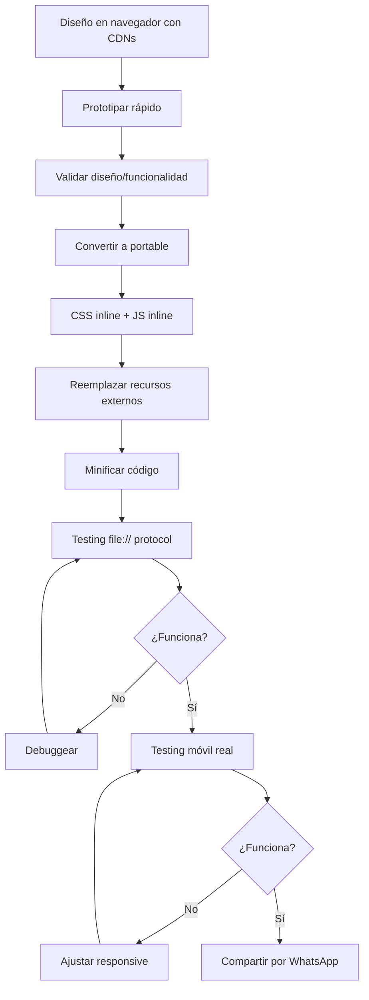

# Mejores Prácticas: HTML Portable para WhatsApp

**Fecha:** 30 de septiembre de 2025
**Versión:** 1.0
**Objetivo:** Crear archivos HTML que funcionen correctamente cuando se comparten por WhatsApp como adjuntos

---

## 📋 Tabla de Contenidos

1. [Problema Fundamental](#problema-fundamental)
2. [Requisitos Técnicos](#requisitos-técnicos)
3. [Arquitectura Auto-contenida](#arquitectura-auto-contenida)
4. [Implementación Paso a Paso](#implementación-paso-a-paso)
5. [Optimizaciones](#optimizaciones)
6. [Testing y Validación](#testing-y-validación)
7. [Checklist Final](#checklist-final)
8. [Recursos](#recursos)

---

## 🎯 Problema Fundamental

### Por Qué Archivos HTML No Funcionan en WhatsApp

Cuando envías un archivo `.html` como adjunto por WhatsApp:

```
Usuario → Envía archivo.html → WhatsApp
                                    ↓
                          Receptor descarga archivo
                                    ↓
                          Sistema abre con file:///
                                    ↓
                          Protocolo file:// BLOQUEA:
                          ❌ CDNs (Tailwind, Bootstrap, etc.)
                          ❌ Google Fonts
                          ❌ Librerías JS externas (Chart.js, etc.)
                          ❌ Cualquier recurso HTTP/HTTPS
```

**Causa:** Política CORS (Cross-Origin Resource Sharing) **solo permite HTTP/HTTPS**, NO `file://`

**Resultado:** HTML "roto" sin estilos, solo texto plano

---

## ✅ Requisitos Técnicos

### Obligatorios

- [x] **CERO dependencias externas** (CDNs, Google Fonts, APIs)
- [x] **CSS 100% inline** en `<style>` tags
- [x] **JavaScript 100% inline** en `<script>` tags
- [x] **Imágenes como Data URIs** (base64) si es necesario
- [x] **Fuentes del sistema** o embebidas como base64
- [x] **Tamaño total < 5MB** (recomendado < 500KB)

### Recomendados

- [x] **Mobile-first responsive design**
- [x] **clamp() para tipografía escalable**
- [x] **Touch targets mínimo 44x44px**
- [x] **Viewport simple:** `width=device-width, initial-scale=1.0`
- [x] **CSS puro para gráficos** (evitar dependencias JS pesadas)

---

## 🏗️ Arquitectura Auto-contenida

### Estructura Base

```html
<!DOCTYPE html>
<html lang="es">
<head>
    <meta charset="UTF-8">
    <meta name="viewport" content="width=device-width, initial-scale=1.0">
    <title>Mi Reporte Portable</title>

    <!-- ==================== CSS INLINE ==================== -->
    <style>
        /* Reset básico */
        * {
            margin: 0;
            padding: 0;
            box-sizing: border-box;
        }

        /* Fuentes del sistema (NO Google Fonts) */
        body {
            font-family: -apple-system, BlinkMacSystemFont, "Segoe UI",
                         Roboto, "Helvetica Neue", Arial, sans-serif;
        }

        /* Tipografía responsive con clamp() */
        h1 { font-size: clamp(1.75rem, 8vw, 3rem); }
        h2 { font-size: clamp(1.5rem, 6vw, 1.875rem); }
        p  { font-size: clamp(0.875rem, 2.5vw, 1rem); }

        /* Todos los demás estilos inline aquí... */
    </style>
</head>
<body>
    <!-- Contenido HTML -->

    <!-- ==================== JAVASCRIPT INLINE ==================== -->
    <script>
        // Todo el código JavaScript inline aquí
        // SIN referencias a librerías externas
    </script>
</body>
</html>
```

---

## 🛠️ Implementación Paso a Paso

### Paso 1: Reemplazar Tailwind CSS

#### ❌ ANTES (con CDN - no funciona)

```html
<head>
    <script src="https://cdn.tailwindcss.com"></script>
</head>
<body>
    <div class="bg-white p-6 rounded-lg shadow-lg">
        <h1 class="text-3xl font-bold text-gray-800">Título</h1>
    </div>
</body>
```

#### ✅ DESPUÉS (CSS inline - funciona)

```html
<head>
    <style>
        .card {
            background: white;
            padding: 1.5rem;
            border-radius: 0.5rem;
            box-shadow: 0 4px 6px rgba(0, 0, 0, 0.1);
        }

        .title {
            font-size: 1.875rem;
            font-weight: 700;
            color: #1f2937;
        }
    </style>
</head>
<body>
    <div class="card">
        <h1 class="title">Título</h1>
    </div>
</body>
```

**Estrategias:**

1. **Opción A - Utilities manuales:** Escribir CSS equivalente
2. **Opción B - Tailwind build:** Generar CSS estático con `npx tailwindcss`
3. **Opción C - Framework email:** Usar Maizzle para auto-inline

---

### Paso 2: Reemplazar Google Fonts

#### ❌ ANTES (CDN - no funciona)

```html
<link href="https://fonts.googleapis.com/css2?family=Inter:wght@400;600;700&display=swap" rel="stylesheet">

<style>
    body {
        font-family: 'Inter', sans-serif;
    }
</style>
```

#### ✅ OPCIÓN A: Fuentes del Sistema (recomendado)

```html
<style>
    body {
        font-family: -apple-system, BlinkMacSystemFont, "Segoe UI",
                     Roboto, "Helvetica Neue", Arial, sans-serif;
        -webkit-font-smoothing: antialiased;
        -moz-osx-font-smoothing: grayscale;
    }
</style>
```

**Ventajas:**
- Cero dependencias
- Mejor rendimiento
- Look nativo en cada plataforma
- Carga instantánea

#### ✅ OPCIÓN B: Fuentes Embebidas (si es crítico)

```html
<style>
    @font-face {
        font-family: 'Inter';
        src: url(data:font/woff2;base64,d09GMgABAAAAAAZcAA4AAAAAD...) format('woff2');
        font-weight: 400;
        font-display: swap;
    }

    @font-face {
        font-family: 'Inter';
        src: url(data:font/woff2;base64,d09GMgABAAAAABhYAA4AAAAAH...) format('woff2');
        font-weight: 700;
        font-display: swap;
    }

    body {
        font-family: 'Inter', sans-serif;
    }
</style>
```

**Herramienta:** https://transfonter.org/ (convierte fuentes a base64)

**Advertencia:** Aumenta tamaño del archivo (~30-100KB por peso de fuente)

---

### Paso 3: Reemplazar Chart.js

#### ❌ ANTES (CDN - no funciona)

```html
<script src="https://cdn.jsdelivr.net/npm/chart.js"></script>
<script>
    new Chart(ctx, {
        type: 'bar',
        data: {...}
    });
</script>
```

#### ✅ OPCIÓN A: Gráficos CSS Puro (recomendado)

```html
<style>
    .chart-bar {
        height: 36px;
        background: linear-gradient(90deg, #14b8a6, #0d9488);
        border-radius: 0.375rem;
        transition: all 0.5s ease;
        display: flex;
        align-items: center;
        justify-content: flex-end;
        padding-right: 0.75rem;
        color: white;
        font-weight: 600;
    }
</style>

<div class="chart-bar" style="width: 75%">75%</div>
<div class="chart-bar" style="width: 60%">60%</div>
<div class="chart-bar" style="width: 45%">45%</div>
```

**Ventajas:**
- Ligero (~0KB adicionales)
- 100% responsive
- Animaciones suaves con CSS
- No requiere JavaScript

#### ✅ OPCIÓN B: Chart.js Inline (si necesitas funcionalidad completa)

1. Descargar: https://cdn.jsdelivr.net/npm/chart.js/dist/chart.min.js
2. Pegar contenido completo en `<script>` tag
3. ~200KB adicionales

```html
<script>
    // Pegar TODO el contenido de chart.min.js aquí (200KB)

    // Luego tu código custom
    new Chart(ctx, { ... });
</script>
```

#### ✅ OPCIÓN C: Gráficos como Imágenes Base64

```bash
# 1. Generar gráfico con Chart.js en navegador
# 2. Exportar como PNG
const imageURL = canvas.toDataURL('image/png');

# 3. Embeber en HTML
```

```html

```

**Ventajas:**
- Gráficos perfectos
- Sin JavaScript
- Archivo estático

**Desventajas:**
- No interactivo
- Tamaño aumenta ~50-100KB por gráfico

---

### Paso 4: Responsive Design

#### Tipografía Escalable con clamp()

```css
/* Mobile-first scaling */
h1 { font-size: clamp(1.75rem, 8vw, 3rem); }
h2 { font-size: clamp(1.5rem, 6vw, 1.875rem); }
h3 { font-size: clamp(1.125rem, 4vw, 1.5rem); }
p  { font-size: clamp(0.875rem, 2.5vw, 1rem); }

/* Buttons con padding escalable */
.button {
    padding: clamp(0.5rem, 2vw, 0.75rem) clamp(1rem, 3vw, 1.5rem);
    font-size: clamp(0.75rem, 2.5vw, 0.875rem);
}
```

#### Media Queries Específicas

```css
/* Extra small devices (< 480px) */
@media (max-width: 480px) {
    .container { padding: 0.75rem; }
    input, button { font-size: 16px; /* Evita auto-zoom iOS */ }
}

/* Tablets (769px - 1024px) */
@media (min-width: 769px) and (max-width: 1024px) {
    .grid { grid-template-columns: repeat(2, 1fr); }
}

/* Desktop (> 1025px) */
@media (min-width: 1025px) {
    .container { max-width: 1400px; }
}

/* Landscape mobile */
@media (max-height: 600px) and (orientation: landscape) {
    header { padding: 1rem; }
}
```

#### Touch Targets

```css
/* Mínimo 44x44px según WCAG */
button, a, .clickable {
    min-width: 44px;
    min-height: 44px;
    touch-action: manipulation;
    -webkit-tap-highlight-color: transparent;
}
```

---

## ⚡ Optimizaciones

### 1. Minificación

```bash
# CSS
npx cssnano styles.css styles.min.css

# JavaScript
npx terser script.js -o script.min.js

# HTML
npx html-minifier input.html -o output.html --collapse-whitespace
```

### 2. Imágenes Optimizadas

```bash
# Convertir a base64
base64 imagen.jpg > imagen.txt

# Optimizar antes de convertir
# Con ImageMagick
convert imagen.jpg -resize 800x600 -quality 85 imagen-opt.jpg

# Con TinyPNG (online)
https://tinypng.com
```

### 3. Lazy Loading de Secciones

```javascript
// Cargar contenido pesado solo cuando sea visible
const observer = new IntersectionObserver((entries) => {
    entries.forEach(entry => {
        if (entry.isIntersecting) {
            // Cargar contenido
            entry.target.classList.add('loaded');
        }
    });
});
```

### 4. Remover Código No Usado

```css
/* ❌ EVITAR código no usado */
.clase-nunca-usada { color: red; }

/* ✅ Solo incluir estilos necesarios */
.card { /* usado en HTML */ }
```

---

## 🧪 Testing y Validación

### Checklist de Testing

```bash
# 1. Verificar que NO hay recursos externos
grep -i "http://" archivo.html  # Debe retornar vacío
grep -i "https://" archivo.html # Debe retornar vacío
grep -i "src=" archivo.html     # Solo data: URIs

# 2. Verificar tamaño
ls -lh archivo.html  # < 500KB recomendado

# 3. Abrir con file:// protocol
open "file:///ruta/completa/archivo.html"

# 4. DevTools: verificar 0 errores CORS
# Console debe estar limpia
```

### Testing en Dispositivos

#### Desktop
1. Abrir con `file:///` en Chrome/Firefox/Safari
2. DevTools → Console (0 errores)
3. DevTools → Network (0 peticiones HTTP)
4. Responsive mode (320px - 2000px)

#### Mobile Real

**iOS:**
```
1. Enviar HTML por WhatsApp a ti mismo
2. Abrir adjunto
3. Verificar renderizado completo
4. Probar interactividad (tabs, clicks)
5. Probar en landscape mode
```

**Android:**
```
1. Enviar HTML por WhatsApp a ti mismo
2. Abrir adjunto
3. Seleccionar visor (Chrome, etc.)
4. Verificar renderizado completo
5. Probar interactividad
```

### Validación HTML

```bash
# W3C Validator (online)
https://validator.w3.org/#validate_by_upload

# O con CLI
npm install -g html-validate
html-validate archivo.html
```

---

## ✅ Checklist Final

### Antes de Compartir

```
HTML:
☐ Todas las etiquetas cerradas correctamente
☐ Meta viewport: width=device-width, initial-scale=1.0
☐ Title descriptivo presente
☐ HTML válido (W3C validator)

CSS:
☐ TODO el CSS en <style> tags inline
☐ NO hay links a hojas de estilo externas
☐ NO hay @import de fuentes externas
☐ Fuentes del sistema o base64
☐ Media queries para responsive
☐ clamp() para tipografía escalable
☐ Touch targets mínimo 44x44px

JAVASCRIPT:
☐ TODO el JS en <script> tags inline
☐ NO hay src= apuntando a CDNs
☐ NO hay dependencias externas
☐ Funciona sin internet

RECURSOS:
☐ Imágenes como data: URIs o eliminadas
☐ NO hay fetch/axios a APIs externas
☐ NO hay iframes con src externo

TAMAÑO:
☐ Archivo total < 5MB
☐ Idealmente < 500KB
☐ Cada imagen base64 < 100KB

TESTING:
☐ Funciona con file:// protocol
☐ 0 errores en DevTools Console
☐ 0 peticiones HTTP en Network tab
☐ Probado en móvil iOS real
☐ Probado en móvil Android real
☐ Funciona en landscape mode
☐ Todas las interacciones funcionan
```

---

## 📚 Recursos

### Herramientas

| Herramienta | Uso | URL |
|-------------|-----|-----|
| **Transfonter** | Convertir fuentes a base64 | https://transfonter.org/ |
| **TinyPNG** | Optimizar imágenes | https://tinypng.com |
| **Base64 Encoder** | Convertir imágenes a base64 | https://www.base64-image.de/ |
| **HTML Minifier** | Minificar HTML | https://www.willpeavy.com/tools/minifier/ |
| **CSS Minifier** | Minificar CSS | https://cssminifier.com/ |
| **W3C Validator** | Validar HTML | https://validator.w3.org/ |

### Frameworks para HTML Portable

| Framework | Descripción | Ideal Para |
|-----------|-------------|------------|
| **Maizzle** | Tailwind → Inline CSS automático | Emails, reportes |
| **MJML** | Framework para emails responsive | Newsletters |
| **Inliner** | Node.js - inline resources | Automatización |
| **Monolith** | CLI - bundle HTML completo | Single page apps |

### Comandos Útiles

```bash
# Crear HTML auto-contenido con Monolith
monolith https://ejemplo.com -o output.html

# Inline CSS con Inliner
npm install -g inliner
inliner input.html > output.html

# Generar Tailwind estático
npx tailwindcss -i input.css -o output.css --minify

# Convertir imagen a base64
base64 -i imagen.jpg -o imagen.txt

# Verificar dependencias externas
grep -Ei "(http://|https://)" archivo.html
```

---

## 📖 Documentación Oficial

### Referencias

1. **MDN - CORS Errors:**
   https://developer.mozilla.org/en-US/docs/Web/HTTP/Guides/CORS/Errors/CORSRequestNotHttp

2. **W3C - HTML5 Specification:**
   https://www.w3.org/TR/html5/

3. **WCAG 2.1 - Touch Target Size:**
   https://www.w3.org/WAI/WCAG21/Understanding/target-size.html

4. **CSS clamp() Function:**
   https://developer.mozilla.org/en-US/docs/Web/CSS/clamp

---

## 🎓 Mejores Prácticas Resumidas

### DO ✅

- **Usar fuentes del sistema** en vez de Google Fonts
- **CSS puro para gráficos simples** en vez de librerías JS
- **clamp() para responsive** en vez de múltiples breakpoints
- **Minificar CSS/JS** antes de embeber
- **Optimizar imágenes** antes de convertir a base64
- **Testing real en móviles** antes de compartir
- **Mantener tamaño < 500KB** para mejor rendimiento

### DON'T ❌

- **NO usar CDNs** (Tailwind, Bootstrap, Chart.js, etc.)
- **NO usar Google Fonts** u otras fuentes remotas
- **NO hacer fetch/axios** a APIs externas
- **NO usar iframes** con src externo
- **NO confiar solo en testing desktop** sin probar móvil
- **NO embeber videos** (usar links externos)
- **NO exceder 5MB** de tamaño total

---

## 📝 Plantilla Base

### Template Mínimo Funcional

```html
<!DOCTYPE html>
<html lang="es">
<head>
    <meta charset="UTF-8">
    <meta name="viewport" content="width=device-width, initial-scale=1.0">
    <title>Mi Reporte Portable</title>

    <style>
        * { margin: 0; padding: 0; box-sizing: border-box; }

        body {
            font-family: -apple-system, BlinkMacSystemFont, "Segoe UI", Roboto, sans-serif;
            padding: 1rem;
            background: #f9fafb;
            color: #1f2937;
        }

        .container {
            max-width: 1200px;
            margin: 0 auto;
        }

        h1 { font-size: clamp(1.75rem, 8vw, 3rem); margin-bottom: 1rem; }
        h2 { font-size: clamp(1.5rem, 6vw, 1.875rem); margin-bottom: 0.75rem; }
        p  { font-size: clamp(0.875rem, 2.5vw, 1rem); line-height: 1.6; }

        .card {
            background: white;
            padding: 2rem;
            border-radius: 0.5rem;
            box-shadow: 0 4px 6px rgba(0,0,0,0.1);
            margin-bottom: 1.5rem;
        }

        @media (max-width: 480px) {
            body { padding: 0.5rem; }
            .card { padding: 1rem; }
        }
    </style>
</head>
<body>
    <div class="container">
        <h1>Título del Reporte</h1>

        <div class="card">
            <h2>Sección 1</h2>
            <p>Contenido aquí...</p>
        </div>

        <div class="card">
            <h2>Sección 2</h2>
            <p>Más contenido...</p>
        </div>
    </div>

    <script>
        // JavaScript inline aquí
        console.log('HTML portable cargado correctamente');
    </script>
</body>
</html>
```

---

## 🔄 Workflow Recomendado

### Proceso de Desarrollo



### Comandos Automatizados

```bash
#!/bin/bash
# build-portable.sh

echo "🔧 Generando HTML portable..."

# 1. Minificar CSS
npx cssnano styles.css styles.min.css

# 2. Minificar JS
npx terser script.js -o script.min.js

# 3. Inline resources
inliner index.html > portable.html

# 4. Verificar tamaño
SIZE=$(du -h portable.html | cut -f1)
echo "📦 Tamaño final: $SIZE"

# 5. Verificar dependencias externas
EXTERNAL=$(grep -Ei "(http://|https://)" portable.html | wc -l)
if [ $EXTERNAL -gt 0 ]; then
    echo "⚠️  Advertencia: $EXTERNAL recursos externos encontrados"
else
    echo "✅ Sin dependencias externas"
fi

# 6. Abrir en navegador para testing
open "file://$(pwd)/portable.html"

echo "✅ Build completado!"
```

---

## 📞 Soporte y Contribuciones

### Problemas Comunes

**Problema:** Fuentes no cargan

```
Solución: Verificar que @font-face usa data: URIs, no URLs
```

**Problema:** Gráficos no aparecen

```
Solución: Verificar que Chart.js esté inline o usar CSS puro
```

**Problema:** Archivo muy pesado (> 5MB)

```
Solución: Optimizar imágenes, eliminar código no usado, considerar PDF
```

---

## 📄 Licencia y Créditos

Este documento fue creado como parte de las mejores prácticas de desarrollo para Contento LATAM.

**Versión:** 1.0
**Última actualización:** 30 de septiembre de 2025
**Mantenedor:** Equipo de Desarrollo Contento LATAM

---

## 🔗 Ver También

- [Responsive Design Best Practices](responsive-design.md)
- [CSS Performance Optimization](css-performance.md)
- [Mobile-First Development Guide](mobile-first.md)
- [WhatsApp Business API Documentation](whatsapp-api.md)

---

**¿Preguntas o sugerencias?** Contacta al equipo de desarrollo.
