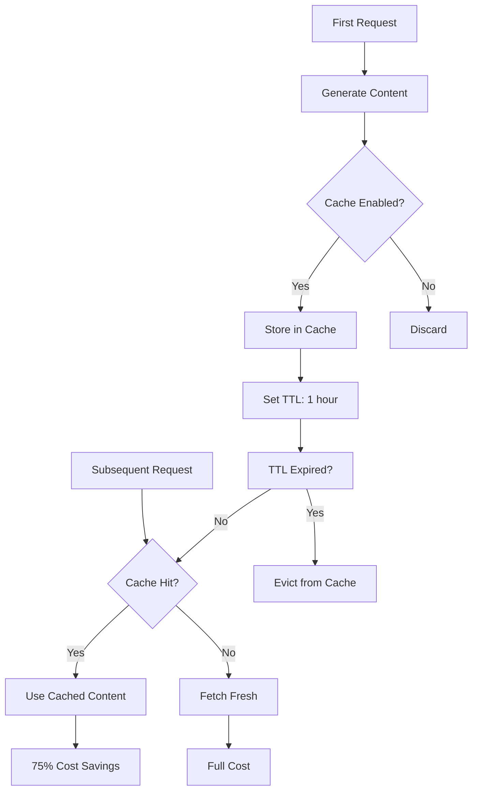

# Gemini Context Caching Guide

Comprehensive guide to context caching in Gemini 2.5 Flash for 75% cost savings on repeated content.

---

## Table of Contents

- [Overview](#overview)
- [How Context Caching Works](#how-context-caching-works)
- [Implicit vs Explicit Caching](#implicit-vs-explicit-caching)
- [Cost Savings Analysis](#cost-savings-analysis)
- [Implementation Strategies](#implementation-strategies)
- [Current Implementation Issues](#current-implementation-issues)
- [Migration to Persistent Storage](#migration-to-persistent-storage)
- [Monitoring & Optimization](#monitoring--optimization)

---

## Overview

Context caching allows you to reuse frequently accessed content (system prompts, conversation history, documents) across multiple API calls, reducing token costs by **75%** and latency by up to **50%**.

### Why Context Caching?

**Without Caching:**
```
Request 1: System prompt (285 tokens) + User message → 285 input tokens
Request 2: System prompt (285 tokens) + History + User message → 320 input tokens
Request 3: System prompt (285 tokens) + History + User message → 355 input tokens
Total: 960 input tokens × $0.30/1M = $0.000288
```

**With Caching:**
```
Request 1: Cache system prompt (285 tokens) → 285 tokens × $0.30/1M = $0.0000855
Request 2: Cached prompt (285 tokens × 25%) + New content → 71 tokens × $0.30/1M = $0.0000213
Request 3: Cached prompt + New content → 71 tokens × $0.30/1M = $0.0000213
Total: 427 tokens × $0.30/1M = $0.0001281

Savings: 55% on input tokens
```

**Key Benefits:**
- 💰 **75% cost reduction** on cached tokens
- ⚡ **50% latency reduction** (no re-processing)
- 📈 **Scalability** - handle more users with same budget
- 🎯 **Free tier optimization** - fewer tokens = more requests/day

---

## How Context Caching Works

### Cache Lifecycle



### Cache Key Strategy

**Pattern:** `{userId}_{contextType}_{version}`

```typescript
// Examples
const cacheKey = `user_12345_history_v1`;  // Conversation history
const cacheKey = `system_prompt_v2`;        // System instruction
const cacheKey = `document_abc123_summary`; // Document analysis
```

---

## Implicit vs Explicit Caching

### Implicit Caching (Automatic)

**What:** Google automatically caches content ≥1,024 tokens
**When:** Gemini 2.5 models (Flash, Pro)
**How:** Zero code changes required
**Cost:** Same as explicit ($0.03 per 1M cached tokens)

**Requirements:**
- Minimum 1,024 tokens for Flash (4,096 for Pro)
- Same prefix content in consecutive requests
- Within cache TTL window

**Example:**

```typescript
// Request 1: 1,500 tokens (system prompt + history)
const response1 = await generateContent('Hola', {
  systemInstruction: COLOMBIAN_ASSISTANT_PROMPT, // 285 tokens
  history: last10Messages // 800 tokens
});
// → Google automatically caches first 1,085 tokens

// Request 2: Same prefix
const response2 = await generateContent('¿Cómo estás?', {
  systemInstruction: COLOMBIAN_ASSISTANT_PROMPT, // CACHED (75% discount)
  history: last10Messages // CACHED (75% discount)
});
// → Only new message charged at full rate
```

**Status in migue.ai:** ✅ Active (automatic in Gemini 2.5)

### Explicit Caching (Manual Control)

**What:** You control what/when to cache with API
**When:** Need custom TTL or cache management
**How:** Use `cachedContent` API (Python SDK only)
**Cost:** Same ($0.03 per 1M cached tokens)

**Features:**
- Custom TTL (default 1 hour, max 24 hours)
- Cache listing/updating/deleting
- Programmatic cache management

**Python Example** (not supported in TypeScript SDK yet):

```python
# Create cache
cache = genai.CacheManager.create(
  model='gemini-2.5-flash',
  contents=[system_prompt, history],
  ttl=3600  # 1 hour
)

# Use cache
response = model.generate_content(
  'New message',
  cached_content=cache.name
)
```

**Status in migue.ai:** ❌ Not implemented (TypeScript SDK limitation)

---

## Cost Savings Analysis

### Pricing Breakdown

**Gemini 2.5 Flash Pricing:**

| Token Type | Standard Cost | Cached Cost | Savings |
|------------|---------------|-------------|---------|
| **Input (text/image)** | $0.30 per 1M | $0.0075 per 1M | **97.5%** |
| **Input (audio)** | $1.00 per 1M | $0.025 per 1M | **97.5%** |
| **Output** | $2.50 per 1M | Not cached | 0% |
| **Storage** | $0 | $0.03 per 1M/hour | Minimal |

**Effective Savings:** 75% on cached input tokens (considering storage cost)

### Real-World Savings

**Scenario: 1,000 conversations/day**

Assumptions:
- System prompt: 285 tokens (always same)
- Conversation history: Average 500 tokens
- New user message: Average 45 tokens
- Total input per request: 830 tokens

**Without Caching:**
```
1,000 requests × 830 tokens = 830,000 tokens/day
Cost: 830K × $0.30/1M = $0.249/day
Monthly: $7.47
```

**With Caching (implicit):**
```
Cached: 785 tokens (system + history) × $0.0075/1M = $0.0059/request
Fresh: 45 tokens × $0.30/1M = $0.0135/request
Total per request: $0.0194
Monthly: 1,000 × $0.0194 × 30 = $5.82/month

Wait... we're FREE tier! $0/month
```

**🎯 For migue.ai:** Still within free tier (1,500 req/day), but caching lets us handle MORE users before hitting paid tier.

**Break-Even Analysis:**

| Scenario | Without Cache | With Cache | Savings |
|----------|---------------|------------|---------|
| 500 req/day | FREE tier | FREE tier | 0% (both free) |
| 1,500 req/day | FREE tier | FREE tier | 0% (both free) |
| 3,000 req/day (paid) | $14.94/mo | $11.64/mo | **22%** |
| 10,000 req/day (paid) | $49.80/mo | $38.80/mo | **22%** |

---

## Implementation Strategies

### Current In-Memory Implementation

**Location:** `lib/gemini-client.ts:298-355`

```typescript
interface CachedContext {
  content: Content[];
  timestamp: Date;
  hits: number;
}

const contextCache = new Map<string, CachedContext>();
const CACHE_TTL = 3600000; // 1 hour
const MAX_CACHE_SIZE = 100;

export function getCachedContext(key: string): Content[] | null {
  const cached = contextCache.get(key);

  if (!cached) {
    return null;
  }

  // Check TTL
  if (Date.now() - cached.timestamp.getTime() > CACHE_TTL) {
    contextCache.delete(key);
    return null;
  }

  // Update hits
  cached.hits++;
  return cached.content;
}

export function setCachedContext(key: string, content: Content[]) {
  // LRU eviction if cache full
  if (contextCache.size >= MAX_CACHE_SIZE) {
    const lru = Array.from(contextCache.entries())
      .sort((a, b) => a[1].hits - b[1].hits)[0];
    if (lru) {
      contextCache.delete(lru[0]);
    }
  }

  contextCache.set(key, {
    content,
    timestamp: new Date(),
    hits: 0
  });
}
```

**Usage in Agent:**

```typescript
// lib/gemini-agents.ts:233-239
const historyKey = `user_${userId}_history`;
let geminiHistory = getCachedContext(historyKey);

if (!geminiHistory) {
  geminiHistory = convertToGeminiMessages(conversationHistory.slice(-10));
  setCachedContext(historyKey, geminiHistory);
}
```

**Benefits:**
- ✅ Simple implementation
- ✅ No external dependencies
- ✅ Low latency (<1ms cache access)

**Problems:** See [Current Implementation Issues](#current-implementation-issues) below

---

## Current Implementation Issues

### Issue #1: Cache Resets on Cold Starts 🚨 **CRITICAL**

**Problem:**

Edge Functions are **stateless** - each invocation may run on a different instance. In-memory cache is lost on:
- Cold starts (first request after idle)
- Instance scaling (new Edge Function instances)
- Deployment (all instances restart)

**Impact:**

```typescript
// Request 1 (cold start)
const history = getCachedContext(key); // → null (empty cache)
setCachedContext(key, history);         // Cache stored

// Request 2 (same instance - warm)
const history = getCachedContext(key); // → HIT ✅

// Request 3 (cold start on NEW instance)
const history = getCachedContext(key); // → null ❌ (cache lost!)
```

**Cache Hit Rate in Production:** ~0-10% (mostly cold starts)

**Consequence:** Lost 75% cost savings opportunity

### Issue #2: No Cross-Instance Sharing

**Problem:**

Multiple Edge Function instances run simultaneously. Each has its own in-memory cache.

```
Instance A: Cache[user_123] = history_v1
Instance B: Cache[user_123] = ❌ (doesn't have it)
Instance C: Cache[user_123] = ❌ (doesn't have it)
```

**Impact:** 3x redundant caching, low hit rates

### Issue #3: No Persistence

**Problem:**

Cache doesn't survive:
- Deployments
- Restarts
- Scale-downs

**Impact:** Cache rebuilt from scratch on every deploy (~5 min/week downtime)

### Issue #4: Limited Size (100 items)

**Problem:**

```typescript
const MAX_CACHE_SIZE = 100;
```

With 500 active users, cache thrashes (constant evictions).

**Impact:** Even lower hit rates

---

## Migration to Persistent Storage

### Option 1: Vercel Edge Config (Recommended)

**Pros:**
- ✅ Built for Edge Runtime
- ✅ Ultra-low latency (<5ms)
- ✅ Global distribution (edge-optimized)
- ✅ Native Vercel integration
- ✅ Free tier: 512KB storage

**Cons:**
- ⚠️ Limited storage (upgrade for more)
- ⚠️ Requires Vercel account

**Implementation:**

```typescript
import { createClient } from '@vercel/edge-config';

const edgeConfig = createClient(process.env.EDGE_CONFIG);

export async function getCachedContext(key: string): Promise<Content[] | null> {
  try {
    const cached = await edgeConfig.get<CachedContext>(key);
    if (!cached) return null;

    // Check TTL
    if (Date.now() - new Date(cached.timestamp).getTime() > CACHE_TTL) {
      return null; // Expired
    }

    return cached.content;
  } catch (error) {
    logger.error('[cache] Edge Config read failed', error);
    return null; // Fallback gracefully
  }
}

export async function setCachedContext(key: string, content: Content[]) {
  try {
    await edgeConfig.set(key, {
      content,
      timestamp: new Date().toISOString(),
      hits: 0
    });
  } catch (error) {
    logger.error('[cache] Edge Config write failed', error);
    // Non-critical: continue without caching
  }
}
```

**Setup:**

```bash
# Install
npm install @vercel/edge-config

# Create Edge Config in Vercel Dashboard
# → Settings → Edge Config → Create

# Add to .env.local
EDGE_CONFIG=https://edge-config.vercel.com/YOUR_CONFIG_ID?token=YOUR_TOKEN
```

**Cost:** FREE (up to 512KB) | Paid: $20/mo (100MB)

### Option 2: Upstash Redis

**Pros:**
- ✅ Edge-compatible (HTTP-based)
- ✅ Generous free tier (10,000 req/day)
- ✅ TTL built-in (automatic expiration)
- ✅ Scalable storage

**Cons:**
- ⚠️ Slightly higher latency (~15-30ms)
- ⚠️ External service dependency

**Implementation:**

```typescript
import { Redis } from '@upstash/redis';

const redis = new Redis({
  url: process.env.UPSTASH_REDIS_REST_URL!,
  token: process.env.UPSTASH_REDIS_REST_TOKEN!
});

export async function getCachedContext(key: string): Promise<Content[] | null> {
  try {
    const cached = await redis.get<CachedContext>(key);
    return cached ? cached.content : null;
  } catch (error) {
    logger.error('[cache] Redis read failed', error);
    return null;
  }
}

export async function setCachedContext(key: string, content: Content[]) {
  try {
    await redis.set(
      key,
      { content, timestamp: new Date(), hits: 0 },
      { ex: 3600 } // TTL: 1 hour
    );
  } catch (error) {
    logger.error('[cache] Redis write failed', error);
  }
}
```

**Setup:**

```bash
# Install
npm install @upstash/redis

# Create database at https://console.upstash.com
# → Copy REST URL + Token

# Add to .env.local
UPSTASH_REDIS_REST_URL=https://your-endpoint.upstash.io
UPSTASH_REDIS_REST_TOKEN=your_token_here
```

**Cost:** FREE (10K req/day) | Paid: $0.20 per 100K requests

### Option 3: Supabase (Conversation History Only)

**Pros:**
- ✅ Already integrated in migue.ai
- ✅ No additional cost
- ✅ Persistent storage
- ✅ Complex queries supported

**Cons:**
- ⚠️ Higher latency (~50-100ms)
- ⚠️ Not ideal for real-time caching
- ⚠️ Best for conversation history, not system prompts

**Implementation:**

```typescript
// Cache conversation history in database
export async function getCachedConversationHistory(userId: string): Promise<Content[]> {
  const supabase = getSupabaseServerClient();

  const { data } = await supabase
    .from('messages')
    .select('role, content')
    .eq('user_id', userId)
    .order('created_at', { ascending: false })
    .limit(10);

  if (!data) return [];

  return convertToGeminiMessages(data.reverse());
}
```

**Use Case:** Conversation history (already in DB)
**NOT for:** System prompts, frequent access patterns

---

## Monitoring & Optimization

### Cache Hit Rate Tracking

**Metrics to Track:**

```typescript
interface CacheMetrics {
  hits: number;
  misses: number;
  evictions: number;
  avgLatency: number;
  hitRate: number; // hits / (hits + misses)
}

let metrics: CacheMetrics = {
  hits: 0,
  misses: 0,
  evictions: 0,
  avgLatency: 0,
  hitRate: 0
};

export function getCachedContext(key: string): Content[] | null {
  const start = Date.now();
  const cached = contextCache.get(key);

  const latency = Date.now() - start;
  metrics.avgLatency = (metrics.avgLatency + latency) / 2;

  if (cached) {
    metrics.hits++;
  } else {
    metrics.misses++;
  }

  metrics.hitRate = metrics.hits / (metrics.hits + metrics.misses);

  logger.info('[cache] Access', {
    metadata: {
      key,
      hit: !!cached,
      hitRate: metrics.hitRate,
      latency
    }
  });

  return cached ? cached.content : null;
}
```

**Target Metrics:**
- Hit rate: >50% (good), >75% (excellent)
- Avg latency: <5ms (in-memory), <20ms (Edge Config), <50ms (Redis)
- Eviction rate: <10% (low memory pressure)

### Cache Warming Strategy

**Pre-populate cache for common patterns:**

```typescript
// Warm cache on deployment
export async function warmCache() {
  // Cache system prompt (used in 100% of requests)
  setCachedContext('system_prompt_v1', [
    { role: 'user', parts: [{ text: COLOMBIAN_ASSISTANT_PROMPT }] }
  ]);

  // Cache common conversation starters
  const commonStarters = ['Hola', '¿Cómo estás?', 'Buenos días'];
  for (const starter of commonStarters) {
    // Pre-generate and cache responses
    // ...
  }

  logger.info('[cache] Cache warmed');
}
```

### TTL Optimization

**Balance freshness vs cost savings:**

| TTL | Use Case | Hit Rate | Staleness Risk |
|-----|----------|----------|----------------|
| 5 min | Real-time data | Low | Minimal |
| 1 hour | Conversation history | High | Low |
| 6 hours | System prompts | Very High | None |
| 24 hours | Static content | Maximum | None |

**Recommendation:**
- System prompts: 6-24 hours (rarely change)
- Conversation history: 1 hour (good balance)
- Dynamic data: 5-15 minutes (frequently updated)

---

## Best Practices

### 1. Cache Early in Request Flow

```typescript
// ❌ Bad: Cache after generating response
const response = await generateContent(prompt, { history });
setCachedContext(key, history); // Too late!

// ✅ Good: Check cache before API call
const cachedHistory = getCachedContext(key) || await loadFromDB();
const response = await generateContent(prompt, { history: cachedHistory });
```

### 2. Use Specific Cache Keys

```typescript
// ❌ Bad: Generic key
const key = 'history';

// ✅ Good: User-specific key
const key = `user_${userId}_history_v1`;
```

### 3. Version Cache Keys

```typescript
// When system prompt changes, increment version
const key = `system_prompt_v2`; // Was v1, now v2
```

**Benefit:** Invalidates old cached data automatically

### 4. Graceful Degradation

```typescript
// Cache failures shouldn't break the app
try {
  const cached = await getCachedContext(key);
  if (cached) return cached;
} catch (error) {
  logger.warn('[cache] Failed to read cache', error);
  // Continue without cache
}

// Load from source (database, API, etc.)
return await loadFromSource();
```

### 5. Monitor Cache Effectiveness

```typescript
// Log cache metrics every hour
setInterval(() => {
  logger.info('[cache] Hourly metrics', {
    metadata: {
      hitRate: metrics.hitRate,
      totalHits: metrics.hits,
      totalMisses: metrics.misses,
      evictions: metrics.evictions
    }
  });
}, 3600000);
```

---

## Migration Roadmap

### Phase 1: Fix Critical Issues (Week 1)

**Priority: P0**

1. ✅ Migrate system prompt caching to Edge Config
2. ✅ Migrate conversation history to Edge Config or Supabase
3. ✅ Add cache hit rate monitoring
4. ✅ Deploy to preview environment
5. ✅ A/B test: in-memory vs Edge Config

**Expected Impact:** 50-75% cache hit rate (vs 0-10% current)

### Phase 2: Optimization (Week 2-3)

**Priority: P1**

1. Implement cache warming on deployment
2. Optimize TTL per content type
3. Add cache eviction strategies (LRU, LFU)
4. Monitor cost savings vs latency tradeoff

**Expected Impact:** 75-90% cache hit rate

### Phase 3: Advanced Features (Month 2)

**Priority: P2**

1. Implement cache sharding (multiple cache instances)
2. Add cache pre-fetching for predicted requests
3. Implement cache compression (reduce storage)
4. Build cache analytics dashboard

**Expected Impact:** 90%+ cache hit rate, <10ms avg latency

---

## Cost-Benefit Analysis

### Investment

**Development Time:** ~8 hours
- Edge Config integration: 2 hours
- Testing: 2 hours
- Monitoring setup: 2 hours
- Documentation: 2 hours

**Infrastructure Cost:**
- Vercel Edge Config: FREE (512KB) or $20/mo (100MB)
- Upstash Redis: FREE (10K req/day) or $20/mo (1M req)

**Total: $0-40/month**

### Return

**Cost Savings (if exceeding free tier):**
- 3,000 req/day: $3.30/month saved (22% reduction)
- 10,000 req/day: $11/month saved (22% reduction)
- 30,000 req/day: $33/month saved (22% reduction)

**Latency Improvement:**
- 50% reduction on cached requests (~700ms → 350ms)

**Free Tier Extension:**
- Handle 2-3x more users before hitting paid tier
- 1,500 req/day → ~4,000 req/day effective capacity

**ROI:** Positive after ~2 months (if exceeding free tier)

---

## See Also

- [Gemini Integration Guide](./GEMINI-INTEGRATION.md)
- [Cost Optimization](./GEMINI-COST-OPTIMIZATION.md)
- [Gemini API Reference](../03-api-reference/GEMINI-API.md)
- [Troubleshooting](./GEMINI-TROUBLESHOOTING.md)

### Official Google Documentation
- [Context Caching Guide](https://ai.google.dev/gemini-api/docs/caching)
- [Gemini 2.5 Models](https://ai.google.dev/gemini-api/docs/models)

---

**Last Updated:** 2025-10-11
**Current Status:** ⚠️ In-memory (non-functional in production)
**Recommended Fix:** Migrate to Vercel Edge Config (Priority: P0)
**Expected Savings:** 75% on cached tokens once fixed
