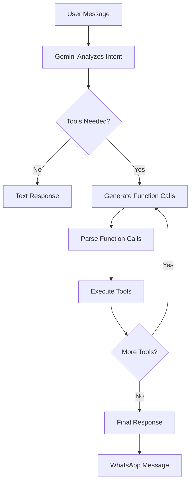

# Gemini Function Calling Guide

Complete guide to implementing tool calling (function calling) with Gemini 2.5 Flash in migue.ai.

---

## Table of Contents

- [Overview](#overview)
- [How It Works](#how-it-works)
- [Tool Definitions](#tool-definitions)
- [Execution Modes](#execution-modes)
- [Multi-Turn Tool Calling](#multi-turn-tool-calling)
- [Error Handling](#error-handling)
- [Best Practices](#best-practices)
- [Code Examples](#code-examples)

---

## Overview

Function calling allows Gemini to interact with external tools and APIs by generating structured function calls based on user intent. Instead of just responding with text, Gemini can autonomously decide to execute actions in the real world.

### Why Function Calling?

**Without Tools:**
```
User: "Recuérdame comprar leche mañana"
Bot: "Claro, te recordaré comprar leche mañana."
❌ No action taken - just a promise
```

**With Tools:**
```
User: "Recuérdame comprar leche mañana"
Bot: [Calls create_reminder]
Bot: "✅ Listo! Te recordaré comprar leche mañana a las 9:00 AM."
✅ Reminder actually created in database
```

### Our Three Tools

| Tool | Purpose | Database | Status |
|------|---------|----------|--------|
| `create_reminder` | Create reminders with date/time | ✅ `reminders` table | Production |
| `schedule_meeting` | Schedule appointments | ✅ `meetings` table | Production |
| `track_expense` | Log expenses | ⚠️ Logging only | Future |

**Location:** `lib/gemini-agents.ts:54-142`

---

## How It Works

### Workflow



### Example Flow

**1. User sends message:**
```
"Recuérdame comprar leche mañana a las 9am"
```

**2. Gemini generates function call:**
```json
{
  "name": "create_reminder",
  "args": {
    "title": "Comprar leche",
    "datetime": "2025-10-12T09:00:00-05:00",
    "notes": null,
    "priority": "normal"
  }
}
```

**3. Our code executes tool:**
```typescript
await createReminder(
  userId,
  "Comprar leche",
  null,
  "2025-10-12T09:00:00-05:00"
);
```

**4. Bot confirms:**
```
✅ Listo! Te recordaré comprar leche mañana a las 9:00 AM.
```

---

## Tool Definitions

### Schema Format (Gemini)

Gemini uses `FunctionDeclaration` format from `@google/generative-ai`:

```typescript
import { FunctionDeclaration, SchemaType } from '@google/generative-ai';

const toolDefinition: FunctionDeclaration = {
  name: 'tool_name',
  description: 'Clear description of what this tool does',
  parameters: {
    type: SchemaType.OBJECT,
    properties: {
      param1: {
        type: SchemaType.STRING,
        description: 'Description of param1'
      },
      param2: {
        type: SchemaType.NUMBER,
        description: 'Description of param2'
      }
    },
    required: ['param1'] // Optional params omitted
  }
};
```

### SchemaType Options

| SchemaType | TypeScript Equivalent | Example |
|------------|----------------------|---------|
| `STRING` | `string` | `"Comprar leche"` |
| `NUMBER` | `number` | `42`, `3.14` |
| `BOOLEAN` | `boolean` | `true`, `false` |
| `OBJECT` | `object` | `{ key: "value" }` |
| `ARRAY` | `Array<T>` | `["item1", "item2"]` |

### Our Tool Definitions

#### 1. create_reminder

**Purpose:** Create timed reminders for the user

**Definition** (`lib/gemini-agents.ts:54-79`):

```typescript
const createReminderTool: FunctionDeclaration = {
  name: 'create_reminder',
  description: 'Crea un recordatorio para el usuario',
  parameters: {
    type: SchemaType.OBJECT,
    properties: {
      title: {
        type: SchemaType.STRING,
        description: 'Título del recordatorio'
      },
      datetime: {
        type: SchemaType.STRING,
        description: 'Fecha y hora en formato ISO 8601 (zona horaria America/Bogota)'
      },
      notes: {
        type: SchemaType.STRING,
        description: 'Notas adicionales (opcional)'
      },
      priority: {
        type: SchemaType.STRING,
        description: 'Prioridad del recordatorio'
      }
    },
    required: ['title', 'datetime']
  }
};
```

**Execution** (`lib/gemini-agents.ts:154-166`):

```typescript
case 'create_reminder': {
  await createReminder(
    userId,
    args.title as string,
    args.notes as string | null || null,
    args.datetime as string
  );
  return `✅ Listo! Guardé tu recordatorio "${args.title}" para ${new Date(args.datetime as string).toLocaleString('es-CO')}`;
}
```

**Example Calls:**

```typescript
// Simple reminder
{
  name: "create_reminder",
  args: {
    title: "Comprar leche",
    datetime: "2025-10-12T09:00:00-05:00"
  }
}

// With notes and priority
{
  name: "create_reminder",
  args: {
    title: "Llamar al doctor",
    datetime: "2025-10-15T14:30:00-05:00",
    notes: "Preguntar por resultados de exámenes",
    priority: "high"
  }
}
```

#### 2. schedule_meeting

**Purpose:** Schedule appointments and meetings

**Definition** (`lib/gemini-agents.ts:81-111`):

```typescript
const scheduleMeetingTool: FunctionDeclaration = {
  name: 'schedule_meeting',
  description: 'Programa una cita o reunión',
  parameters: {
    type: SchemaType.OBJECT,
    properties: {
      title: {
        type: SchemaType.STRING,
        description: 'Título de la cita'
      },
      datetime: {
        type: SchemaType.STRING,
        description: 'Fecha y hora en formato ISO 8601'
      },
      duration_minutes: {
        type: SchemaType.NUMBER,
        description: 'Duración en minutos'
      },
      attendees: {
        type: SchemaType.ARRAY,
        items: { type: SchemaType.STRING },
        description: 'Lista de asistentes'
      },
      location: {
        type: SchemaType.STRING,
        description: 'Ubicación o link de videollamada'
      }
    },
    required: ['title', 'datetime', 'duration_minutes']
  }
};
```

**Execution** (`lib/gemini-agents.ts:169-186`):

```typescript
case 'schedule_meeting': {
  const meetingDescription = `Agendar ${args.title} para ${args.datetime} con duración de ${args.duration_minutes} minutos${
    args.location ? ` en ${args.location}` : ''
  }${args.attendees ? ` con ${(args.attendees as string[]).join(', ')}` : ''}`;

  const result = await scheduleMeetingFromIntent({
    userId,
    userMessage: meetingDescription,
    conversationHistory: [],
    fallbackTimeZone: 'America/Bogota'
  });

  if (result.status === 'scheduled') {
    return `✅ Agendé tu cita "${args.title}" para ${new Date(args.datetime as string).toLocaleString('es-CO')}`;
  }
  return 'No pude agendar la cita. Intenta de nuevo.';
}
```

**Example Call:**

```typescript
{
  name: "schedule_meeting",
  args: {
    title: "Reunión con equipo",
    datetime: "2025-10-15T10:00:00-05:00",
    duration_minutes: 60,
    attendees: ["Juan", "María"],
    location: "Sala de conferencias"
  }
}
```

#### 3. track_expense

**Purpose:** Log expenses for finance tracking

**Definition** (`lib/gemini-agents.ts:113-142`):

```typescript
const trackExpenseTool: FunctionDeclaration = {
  name: 'track_expense',
  description: 'Registra un gasto o egreso',
  parameters: {
    type: SchemaType.OBJECT,
    properties: {
      amount: {
        type: SchemaType.NUMBER,
        description: 'Monto del gasto'
      },
      currency: {
        type: SchemaType.STRING,
        description: 'Moneda (por defecto COP)'
      },
      category: {
        type: SchemaType.STRING,
        description: 'Categoría del gasto'
      },
      description: {
        type: SchemaType.STRING,
        description: 'Descripción del gasto'
      },
      date: {
        type: SchemaType.STRING,
        description: 'Fecha del gasto en formato ISO 8601'
      }
    },
    required: ['amount', 'category', 'description']
  }
};
```

**Execution** (`lib/gemini-agents.ts:188-201`):

```typescript
case 'track_expense': {
  // TODO: Implement expense tracking when database table is ready
  logger.info('[gemini-agent] Expense tracking called', {
    metadata: {
      userId,
      amount: args.amount,
      category: args.category,
      description: args.description
    }
  });

  // For now, just acknowledge
  return `✅ Registré tu gasto de $${(args.amount as number).toLocaleString('es-CO')} en ${args.category}`;
}
```

⚠️ **Status:** Logging only - database integration pending

**Example Call:**

```typescript
{
  name: "track_expense",
  args: {
    amount: 45000,
    currency: "COP",
    category: "Alimentación",
    description: "Almuerzo en restaurante",
    date: "2025-10-11T14:00:00-05:00"
  }
}
```

---

## Execution Modes

### AUTO (Default - Recommended)

Model decides whether to call functions or respond with text.

```typescript
const chat = model.startChat({
  tools: [{ functionDeclarations: [tool1, tool2] }]
  // mode: AUTO (implicit)
});
```

**Use Cases:**
- Mixed conversations (text + actions)
- Intent detection
- Natural conversation flow

**Example:**
```
User: "Hola, ¿cómo estás?"
→ Text response (no tool call)

User: "Recuérdame comprar leche"
→ Tool call: create_reminder
```

### ANY (Force Tool Usage)

Model MUST call a function (no text-only responses).

```typescript
const chat = model.startChat({
  tools: [{ functionDeclarations: [tool1, tool2] }],
  toolConfig: {
    functionCallingConfig: {
      mode: FunctionCallingMode.ANY
    }
  }
});
```

**Use Cases:**
- Structured data extraction
- Always-execute scenarios
- Form filling

**Example:**
```
User: "Juan, 30 años, ingeniero"
→ MUST call extract_user_info (can't just respond with text)
```

### NONE (Disable Tools)

Model cannot call functions (text-only mode).

```typescript
const chat = model.startChat({
  tools: [{ functionDeclarations: [tool1, tool2] }],
  toolConfig: {
    functionCallingConfig: {
      mode: FunctionCallingMode.NONE
    }
  }
});
```

**Use Cases:**
- Read-only conversations
- Information retrieval
- Safety restrictions

⚠️ **Note:** We don't use ANY or NONE in migue.ai - AUTO mode works best.

---

## Multi-Turn Tool Calling

### The Problem

Some user requests require **multiple tools**:

```
User: "Recuérdame comprar leche mañana y agéndame cita con el doctor el viernes"
→ Needs: create_reminder + schedule_meeting
```

### Sequential Execution (Current)

**Implementation** (`lib/gemini-agents.ts:254-281`):

```typescript
let iterations = 0;
const maxIterations = 5; // Prevent infinite loops

if (parsed.functionCalls && parsed.functionCalls.length > 0) {
  const toolResults: string[] = [];

  for (const call of parsed.functionCalls) {
    logger.info('[gemini-agent] Executing tool', {
      metadata: { tool: call.name, args: call.args }
    });

    const toolResult = await executeToolCall(call.name, call.args, userId);
    toolResults.push(toolResult);

    iterations++;
    if (iterations >= maxIterations) {
      logger.warn('[gemini-agent] Max iterations reached');
      break;
    }
  }

  // Combine tool results
  if (toolResults.length > 0) {
    finalResponse = toolResults.join('\n');
  }
}
```

**Characteristics:**
- Executes tools one by one
- Max 5 iterations to prevent infinite loops
- Results combined into final response

### Parallel Execution (Future)

Gemini supports **parallel function calling** - execute multiple tools simultaneously:

```typescript
// Future implementation
const calls = response.functionCalls; // [create_reminder, schedule_meeting]

// Execute in parallel
const results = await Promise.all(
  calls.map(call => executeToolCall(call.name, call.args, userId))
);
```

**Benefits:**
- 2-3x faster for multi-tool requests
- Better user experience
- More efficient API usage

**Roadmap:** Phase 4 (Q2 2026)

---

## Error Handling

### Tool Execution Failures

**Pattern** (`lib/gemini-agents.ts:147-211`):

```typescript
async function executeToolCall(
  name: string,
  args: Record<string, unknown>,
  userId: string
): Promise<string> {
  try {
    switch (name) {
      case 'create_reminder': {
        try {
          await createReminder(userId, ...);
          return `✅ Listo! Guardé tu recordatorio...`;
        } catch (error) {
          logger.error('[gemini-agent] Failed to create reminder', error);
          return 'No pude crear el recordatorio. Intenta de nuevo.';
        }
      }
      // ...
    }
  } catch (error) {
    logger.error('[gemini-agent] Tool execution failed', error);
    return 'Hubo un error al ejecutar esa acción. Intenta de nuevo.';
  }
}
```

**Error Response Strategy:**
1. Log error with metadata
2. Return user-friendly Spanish message
3. Don't expose technical details
4. Suggest retry

### Invalid Arguments

**Validation:**

```typescript
// Type assertion with runtime check
const title = args.title as string;
if (!title || title.trim() === '') {
  return 'El título del recordatorio no puede estar vacío.';
}

const datetime = args.datetime as string;
try {
  const date = new Date(datetime);
  if (isNaN(date.getTime())) {
    return 'La fecha no es válida. Usa formato como "mañana a las 9am".';
  }
} catch {
  return 'No pude entender la fecha. ¿Podrías especificarla de otra forma?';
}
```

### Missing Required Parameters

Gemini validates required parameters, but we add extra checks:

```typescript
const createReminderTool = {
  parameters: {
    required: ['title', 'datetime'] // Gemini validates
  }
};

// Our additional validation
if (!args.title || !args.datetime) {
  logger.warn('[gemini-agent] Missing required params', { args });
  return 'Necesito al menos el título y la fecha para crear el recordatorio.';
}
```

---

## Best Practices

### 1. Clear Tool Descriptions (Spanish)

**❌ Bad:**
```typescript
description: 'Create reminder'
```

**✅ Good:**
```typescript
description: 'Crea un recordatorio para el usuario con fecha, hora y notas opcionales. Usa formato ISO 8601 para datetime en zona horaria America/Bogota.'
```

**Why:** Gemini uses descriptions to decide when to call tools. Be explicit!

### 2. Specific Parameter Constraints

**❌ Bad:**
```typescript
datetime: {
  type: SchemaType.STRING,
  description: 'Date and time'
}
```

**✅ Good:**
```typescript
datetime: {
  type: SchemaType.STRING,
  description: 'Fecha y hora en formato ISO 8601 (ej: 2025-10-12T09:00:00-05:00). Zona horaria: America/Bogota (UTC-5).'
}
```

### 3. Limit Total Tools (10-20 Maximum)

**Current:** 3 tools ✅

**Recommendation:** Keep under 20 tools total

**Why:** Too many tools confuse the model and increase latency.

### 4. Low Temperature for Determinism

```typescript
const model = getGeminiModel('gemini-2.5-flash-lite');
model.generationConfig.temperature = 0.3; // Lower = more predictable
```

**Default:** 0.7 (balanced)
**For tools:** 0.2-0.4 (more deterministic)

### 5. Validate All Outputs

```typescript
const result = await executeToolCall(name, args, userId);

// Validate result format
if (typeof result !== 'string') {
  logger.error('[gemini-agent] Invalid tool result type', { result });
  return 'Hubo un error interno. Intenta de nuevo.';
}

// Validate result content
if (result.trim() === '') {
  return 'La acción se completó pero no tengo un mensaje de confirmación.';
}
```

### 6. Log Everything

```typescript
logger.info('[gemini-agent] Executing tool', {
  metadata: {
    tool: call.name,
    args: call.args,
    userId,
    timestamp: new Date().toISOString()
  }
});
```

**Benefits:**
- Debug function calling issues
- Monitor tool usage patterns
- Track success/failure rates

---

## Code Examples

### Basic Tool Execution

```typescript
import { createGeminiProactiveAgent } from '@/lib/gemini-agents';

async function handleMessage(message: string, userId: string) {
  const agent = createGeminiProactiveAgent();

  // Agent automatically decides if tools are needed
  const response = await agent.respond(message, userId, []);

  return response;
}

// Usage
const response = await handleMessage(
  'Recuérdame comprar leche mañana',
  'user123'
);
// → "✅ Listo! Te recordaré comprar leche mañana a las 9:00 AM."
// (Reminder actually created in database)
```

### Multi-Tool Request

```typescript
const response = await agent.respond(
  'Recuérdame comprar leche mañana y agéndame cita con el doctor el viernes',
  'user123',
  []
);

// Gemini generates two function calls:
// 1. create_reminder({ title: "Comprar leche", ... })
// 2. schedule_meeting({ title: "Cita con el doctor", ... })

// Response:
// ✅ Listo! Te recordaré comprar leche mañana a las 9:00 AM.
// ✅ Agendé tu cita "Cita con el doctor" para el viernes 15 de octubre a las 10:00 AM.
```

### Custom Tool Definition

```typescript
import { FunctionDeclaration, SchemaType } from '@google/generative-ai';

const sendEmailTool: FunctionDeclaration = {
  name: 'send_email',
  description: 'Envía un email al destinatario especificado',
  parameters: {
    type: SchemaType.OBJECT,
    properties: {
      to: {
        type: SchemaType.STRING,
        description: 'Email del destinatario'
      },
      subject: {
        type: SchemaType.STRING,
        description: 'Asunto del email'
      },
      body: {
        type: SchemaType.STRING,
        description: 'Cuerpo del mensaje'
      }
    },
    required: ['to', 'subject', 'body']
  }
};

// Add to agent tools
const agent = new GeminiProactiveAgent();
agent.tools.push(sendEmailTool);
```

### Tool Execution with Retry

```typescript
async function executeToolWithRetry(
  name: string,
  args: Record<string, unknown>,
  userId: string,
  maxRetries = 2
): Promise<string> {
  let lastError: Error | null = null;

  for (let attempt = 0; attempt <= maxRetries; attempt++) {
    try {
      return await executeToolCall(name, args, userId);
    } catch (error) {
      lastError = error as Error;
      logger.warn(`[gemini-agent] Tool execution failed (attempt ${attempt + 1})`, error);

      if (attempt < maxRetries) {
        // Exponential backoff
        await new Promise(r => setTimeout(r, Math.pow(2, attempt) * 1000));
      }
    }
  }

  logger.error('[gemini-agent] Tool execution failed after retries', lastError);
  return 'No pude completar esa acción después de varios intentos. Intenta de nuevo más tarde.';
}
```

---

## Gemini vs Claude vs OpenAI

### Function Declaration Format

**Gemini:**
```typescript
{
  name: 'create_reminder',
  parameters: {
    type: SchemaType.OBJECT,
    properties: { ... }
  }
}
```

**Claude:**
```typescript
{
  name: 'create_reminder',
  input_schema: {
    type: 'object',
    properties: { ... }
  }
}
```

**OpenAI:**
```typescript
{
  type: 'function',
  function: {
    name: 'create_reminder',
    parameters: {
      type: 'object',
      properties: { ... }
    }
  }
}
```

**Takeaway:** Similar concepts, different syntax. Our abstraction handles conversion.

### Execution Modes

| Feature | Gemini | Claude | OpenAI |
|---------|--------|--------|--------|
| **Auto mode** | ✅ AUTO | ✅ auto | ✅ auto |
| **Force tools** | ✅ ANY | ✅ required | ✅ required |
| **Disable tools** | ✅ NONE | ✅ (omit tools) | ✅ none |
| **Parallel calling** | ✅ Yes | ✅ Yes | ❌ No |

---

## Troubleshooting

### Tools Not Being Called

**Symptoms:**
- User requests action but gets text response
- No function calls in parsed response

**Solutions:**

1. **Check tool description clarity:**
```typescript
// ❌ Too vague
description: 'Create reminder'

// ✅ Clear and specific
description: 'Crea un recordatorio para el usuario con fecha, hora específica y notas opcionales'
```

2. **Check system prompt:**
```typescript
// Ensure system prompt encourages tool usage
const systemPrompt = `...
SIEMPRE usa las herramientas cuando el usuario lo solicite.
Detecta intenciones aunque no sean explícitas.
...`;
```

3. **Check execution mode:**
```typescript
// Should be AUTO (default) or ANY
const chat = model.startChat({
  tools: [{ functionDeclarations: [tool1, tool2] }]
  // No toolConfig = AUTO mode
});
```

### Invalid Arguments

**Symptoms:**
- Tool called but execution fails
- Type errors in executeToolCall

**Solution:**

```typescript
// Add runtime validation
if (typeof args.amount !== 'number' || args.amount <= 0) {
  return 'El monto debe ser un número positivo.';
}

if (typeof args.title !== 'string' || args.title.trim() === '') {
  return 'El título no puede estar vacío.';
}
```

### Infinite Loop Protection

**Symptoms:**
- Same tool called repeatedly
- Max iterations reached warning in logs

**Current Protection:**
```typescript
const maxIterations = 5;
let iterations = 0;

for (const call of functionCalls) {
  // ...
  iterations++;
  if (iterations >= maxIterations) {
    logger.warn('[gemini-agent] Max iterations reached');
    break;
  }
}
```

**If still happening:**
- Check if tool execution returns proper confirmation
- Verify tool doesn't trigger itself recursively
- Add deduplication logic

---

## See Also

- [Gemini Integration Guide](./GEMINI-INTEGRATION.md)
- [Gemini API Reference](../03-api-reference/GEMINI-API.md)
- [Cost Optimization](./GEMINI-COST-OPTIMIZATION.md)
- [Troubleshooting](./GEMINI-TROUBLESHOOTING.md)

### Official Google Documentation
- [Function Calling Guide](https://ai.google.dev/gemini-api/docs/function-calling)
- [Gemini Models](https://ai.google.dev/gemini-api/docs/models)

---

**Last Updated:** 2025-10-11
**Tools Count:** 3 (create_reminder, schedule_meeting, track_expense)
**Execution Mode:** AUTO (model decides)
**Max Iterations:** 5
