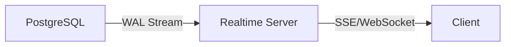

# Realtime Subscriptions

PostgreSQL change events via Server-Sent Events (SSE) - available but not implemented in migue.ai.

## Overview

**Supabase Realtime** broadcasts PostgreSQL changes (INSERT, UPDATE, DELETE) to clients via WebSockets or SSE.

**migue.ai status**: ⚠️ **Not implemented** (fire-and-forget webhook pattern instead)

**Why not used:**
- WhatsApp webhook is fire-and-forget (no client connections)
- All processing server-side (Edge Functions)
- No live dashboard requiring realtime updates
- Would add unnecessary complexity + cost

## How It Works

### PostgreSQL Replication



1. **WAL (Write-Ahead Log)**: PostgreSQL change stream
2. **Realtime Server**: Filters and broadcasts changes
3. **Client**: Receives events via SSE or WebSocket

### Enable Replication

```sql
-- Enable realtime for a table
ALTER TABLE messages_v2 REPLICA IDENTITY FULL;
```

**Replica Identity:**
- `DEFAULT` - Only primary key in events
- `FULL` - All columns in events (required for Supabase)

## TypeScript Client (Edge Runtime)

### Subscribe to Changes

```typescript
import { createClient } from '@supabase/supabase-js'

const supabase = createClient(url, anonKey)

// Subscribe to new messages
const channel = supabase
  .channel('messages-channel')
  .on(
    'postgres_changes',
    {
      event: 'INSERT',
      schema: 'public',
      table: 'messages_v2',
      filter: 'conversation_id=eq.abc-123'
    },
    (payload) => {
      console.log('New message:', payload.new)
    }
  )
  .subscribe()
```

### Subscription Events

| Event | Description |
|-------|-------------|
| `INSERT` | New row created |
| `UPDATE` | Row updated |
| `DELETE` | Row deleted |
| `*` | All events |

### Filters

```typescript
// Filter by column value
filter: 'user_id=eq.user-uuid'

// Filter by status
filter: 'status=eq.active'

// Multiple conditions (AND)
filter: 'user_id=eq.user-uuid,status=eq.active'
```

## Edge Runtime Compatibility

### SSE (Server-Sent Events)

**Compatible with Edge Runtime:**
```typescript
const eventSource = new EventSource(`${url}/realtime/v1/stream?...`)

eventSource.onmessage = (event) => {
  console.log('Message:', JSON.parse(event.data))
}
```

**Note**: Edge Functions don't support long-running connections → Realtime best for client-side.

### WebSockets

**NOT compatible with Edge Runtime:**
```typescript
// ❌ WebSocket not available in Vercel Edge Runtime
const ws = new WebSocket('wss://...')
```

## Use Cases (If Implemented)

### 1. Live Dashboard

**Example**: Admin panel showing new messages in real-time

```typescript
// pages/admin/dashboard.tsx
'use client'

import { useEffect, useState } from 'react'
import { createBrowserClient } from '@supabase/ssr'

export default function Dashboard() {
  const [messages, setMessages] = useState([])

  useEffect(() => {
    const supabase = createBrowserClient(url, anonKey)

    const channel = supabase
      .channel('admin-messages')
      .on(
        'postgres_changes',
        { event: 'INSERT', schema: 'public', table: 'messages_v2' },
        (payload) => {
          setMessages(prev => [payload.new, ...prev])
        }
      )
      .subscribe()

    return () => { channel.unsubscribe() }
  }, [])

  return (
    <div>
      {messages.map(msg => (
        <div key={msg.id}>{msg.content}</div>
      ))}
    </div>
  )
}
```

### 2. User Presence

**Example**: Show which users are online

```typescript
const channel = supabase.channel('online-users')

// Track presence
await channel.track({ user_id: userId, online_at: new Date().toISOString() })

// Listen for presence changes
channel.on('presence', { event: 'sync' }, () => {
  const state = channel.presenceState()
  console.log('Online users:', Object.keys(state))
})
```

### 3. Collaborative Editing

**Example**: Multiple admins editing same data

```typescript
channel
  .on('postgres_changes', {
    event: 'UPDATE',
    schema: 'public',
    table: 'reminders',
    filter: `id=eq.${reminderId}`
  }, (payload) => {
    // Another admin updated this reminder
    alert('Reminder updated by another user')
    refetchData()
  })
  .subscribe()
```

## Why Not Used in migue.ai

### 1. Fire-and-Forget Webhook Pattern

**WhatsApp webhook** (app/api/whatsapp/webhook/route.ts):
```typescript
export async function POST(req: Request): Promise<Response> {
  // Receive message
  const body = await req.json()

  // Process immediately
  await processMessage(body)

  // Return 200 OK (no client connection)
  return new Response('OK', { status: 200 })
}
```

**No client to send realtime updates to** → All processing server-side.

### 2. No Live UI

migue.ai doesn't have:
- Admin dashboard with live updates
- Customer-facing chat UI
- Real-time analytics dashboards

**All interactions via WhatsApp** → No need for browser-based realtime.

### 3. Edge Runtime Constraints

**Vercel Edge Functions** don't support:
- Long-lived connections
- Background tasks
- Stateful subscriptions

**Better approach**: Cron jobs for periodic tasks (reminders, window maintenance).

### 4. Cost Optimization

**Realtime pricing:**
- $10/month per 1M messages (Pro tier)
- Bandwidth costs

**Current cost**: $0 (not using Realtime)

## When to Consider Realtime

**Add Realtime if migue.ai builds:**

1. **Admin Dashboard**
   - Live message feed
   - Real-time user activity
   - Cost tracking graphs

2. **Customer Portal**
   - Web-based chat interface
   - Order status updates
   - Appointment confirmations

3. **Team Collaboration**
   - Multiple admins managing conversations
   - Shared reminder editing
   - Presence indicators

## Migration Path

### 1. Enable Replication

```sql
-- Tables to enable
ALTER TABLE messages_v2 REPLICA IDENTITY FULL;
ALTER TABLE reminders REPLICA IDENTITY FULL;
ALTER TABLE user_interactions REPLICA IDENTITY FULL;
```

### 2. Create Client Component

```typescript
// components/realtime-messages.tsx
'use client'

import { useEffect } from 'react'
import { createBrowserClient } from '@supabase/ssr'

export function RealtimeMessages({ userId }: { userId: string }) {
  useEffect(() => {
    const supabase = createBrowserClient(
      process.env.NEXT_PUBLIC_SUPABASE_URL!,
      process.env.NEXT_PUBLIC_SUPABASE_ANON_KEY!
    )

    const channel = supabase
      .channel(`user-${userId}`)
      .on('postgres_changes', {
        event: '*',
        schema: 'public',
        table: 'messages_v2',
        filter: `user_id=eq.${userId}`
      }, handleChange)
      .subscribe()

    return () => { channel.unsubscribe() }
  }, [userId])

  return <div>Messages will update in real-time</div>
}
```

### 3. Add to Page

```typescript
// app/admin/messages/page.tsx
import { RealtimeMessages } from '@/components/realtime-messages'

export default function MessagesPage() {
  return (
    <div>
      <h1>Messages</h1>
      <RealtimeMessages userId="..." />
    </div>
  )
}
```

## Resources

- **Official**: [Supabase Realtime](https://supabase.com/docs/guides/realtime)
- **Official**: [Broadcast & Presence](https://supabase.com/docs/guides/realtime/broadcast)
- **Edge Runtime**: [Vercel Edge Functions Limits](https://vercel.com/docs/functions/edge-functions/limitations)

**Last Updated**: 2025-10-11
