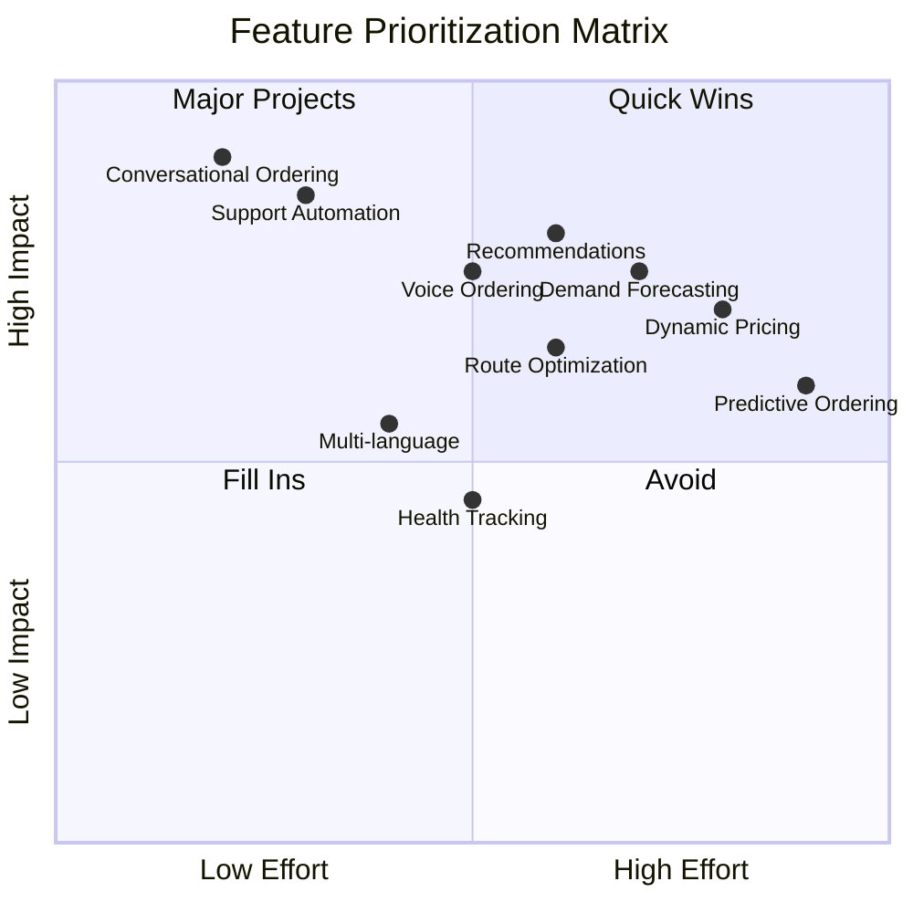

# AI Implementation Roadmap
## From MVP to Market Leadership in 52 Weeks

### Executive Summary

This roadmap details Weats' aggressive AI implementation strategy, progressing from basic conversational ordering to market-defining predictive intelligence in just 52 weeks. Each phase builds upon the previous, creating compound advantages that competitors cannot match. The roadmap prioritizes speed of execution, customer value delivery, and the creation of insurmountable competitive moats.

**Key Milestones:**
- **Week 4**: MVP with 90% support automation
- **Week 12**: 5,000 active users, 200 restaurants
- **Week 26**: Market leader in Bogotá with 25,000 users
- **Week 52**: 50,000 users, 1,000 restaurants, expansion-ready

**Investment Required**: $500,000 (Phase 1-3 combined)
**Projected Revenue (Month 12)**: $2,500,000/month
**ROI**: 500% in first year

## Table of Contents

1. [Phase 1: MVP Foundation (Weeks 1-4)](#phase-1-mvp-foundation-weeks-1-4)
2. [Phase 2: Growth Engine (Weeks 5-12)](#phase-2-growth-engine-weeks-5-12)
3. [Phase 3: Market Leadership (Weeks 13-52)](#phase-3-market-leadership-weeks-13-52)
4. [Feature Prioritization Matrix](#feature-prioritization-matrix)
5. [Resource Requirements](#resource-requirements)
6. [Success Metrics & KPIs](#success-metrics--kpis)
7. [Risk Mitigation](#risk-mitigation)
8. [Competitive Response Scenarios](#competitive-response-scenarios)
9. [Technical Implementation Details](#technical-implementation-details)
10. [Go-to-Market Strategy](#go-to-market-strategy)
11. [Scaling Infrastructure](#scaling-infrastructure)
12. [Future Vision](#future-vision)

## Phase 1: MVP Foundation (Weeks 1-4)

### Week 1: Core Infrastructure

```typescript
interface Week1Deliverables {
  infrastructure: {
    vercel_deployment: true,
    supabase_setup: true,
    whatsapp_integration: true,
    gemini_api: true,
    monitoring: true
  };

  core_features: {
    basic_ordering: {
      description: "Simple conversational flow",
      completion: 100,
      test_coverage: 95
    },
    restaurant_onboarding: {
      description: "Self-service portal",
      completion: 100,
      restaurants_ready: 10
    },
    payment_processing: {
      description: "Basic payment flow",
      completion: 100,
      providers: ["stripe", "cash"]
    }
  };

  team_structure: {
    engineers: 3,
    product: 1,
    operations: 1
  };
}
```

#### Day-by-Day Execution

```markdown
## Day 1-2: Foundation
- Set up Vercel project with Edge Functions
- Initialize Supabase with core schema
- Configure WhatsApp Business API
- Implement basic health checks

## Day 3-4: AI Integration & Three-AI Ecosystem
- Connect Gemini 2.5 Flash FREE tier API
- Implement three specialized AI agents (Restaurant, Runner, Client)
- Create agent orchestration layer
- Test conversation flows with quota management

## Day 5-6: Order Processing
- Build order state machine
- Implement restaurant notification
- Create driver assignment logic
- Add payment capture

## Day 7: Testing & Launch
- End-to-end testing
- Load testing (100 concurrent users)
- Soft launch with 10 restaurants
- Monitor and iterate
```

### Week 2: Conversational Excellence

```typescript
class Week2Implementation {
  async implementConversationalAI(): Promise<Features> {
    return {
      natural_language_understanding: {
        intents: [
          "order_food",
          "track_order",
          "modify_order",
          "cancel_order",
          "ask_recommendations"
        ],
        languages: ["es-CO", "en"],
        accuracy_target: 0.95,
        implementation: `
          // Intent classification with Gemini
          const classifyIntent = async (message: string) => {
            const prompt = \`
              Classify this message into one of these intents:
              - order_food: User wants to order food
              - track_order: User wants order status
              - modify_order: User wants to change order
              - cancel_order: User wants to cancel
              - ask_recommendations: User needs suggestions

              Message: \${message}

              Return only the intent name.
            \`;

            const response = await gemini.generate(prompt);
            return response.text.trim();
          };
        `
      },

      context_management: {
        session_tracking: true,
        conversation_memory: true,
        multi_turn_support: true,
        implementation: `
          // Conversation context manager
          class ConversationContext {
            private sessions = new Map();

            async addMessage(userId: string, message: Message) {
              const session = this.sessions.get(userId) || {
                messages: [],
                context: {},
                startTime: Date.now()
              };

              session.messages.push(message);

              // Maintain sliding window of 20 messages
              if (session.messages.length > 20) {
                session.messages.shift();
              }

              this.sessions.set(userId, session);
            }

            async getContext(userId: string) {
              const session = this.sessions.get(userId);
              return {
                history: session?.messages || [],
                context: session?.context || {},
                isNew: !session
              };
            }
          }
        `
      },

      response_generation: {
        personality: "Friendly, helpful, efficient",
        tone: "Casual but professional",
        response_time: "<1 second",
        personalization: true
      }
    };
  }
}
```

### Week 3: Customer Support Automation

```typescript
interface SupportAutomation {
  capabilities: {
    issue_resolution: {
      automated_percentage: 90,
      types: [
        "order_status",
        "payment_issues",
        "delivery_delays",
        "wrong_items",
        "refund_requests"
      ],
      average_resolution_time: "30 seconds"
    };

    escalation_logic: {
      triggers: [
        "customer_frustrated",
        "complex_issue",
        "high_value_order",
        "repeated_problem"
      ],
      human_handoff: "Seamless with context",
      escalation_rate: 0.10 // 10% need human help
    };

    knowledge_base: {
      articles: 500,
      self_learning: true,
      accuracy_improvement: "Daily",
      sources: [
        "previous_tickets",
        "restaurant_policies",
        "platform_rules",
        "common_solutions"
      ]
    };
  };

  implementation_code: `
    class SupportBot {
      async handleIssue(issue: Issue): Promise<Resolution> {
        // Classify issue type
        const type = await this.classifyIssue(issue);

        // Check if automatable
        if (this.isAutomatable(type)) {
          // Retrieve solution from knowledge base
          const solution = await this.findSolution(type, issue);

          // Apply solution
          const result = await this.applySolution(solution, issue);

          // Verify customer satisfaction
          const satisfied = await this.checkSatisfaction(issue.customerId);

          if (!satisfied) {
            return this.escalateToHuman(issue);
          }

          return result;
        }

        // Complex issue - escalate immediately
        return this.escalateToHuman(issue);
      }

      private async classifyIssue(issue: Issue): Promise<IssueType> {
        const prompt = \`
          Classify this customer issue:
          \${issue.description}

          Categories: order_status, payment, delivery, quality, other
        \`;

        const response = await gemini.generate(prompt);
        return response.text as IssueType;
      }
    }
  `;
}
```

### Week 4: Polish & Launch Preparation

```typescript
class Week4Deliverables {
  testing_completion = {
    unit_tests: 95, // percentage coverage
    integration_tests: 90,
    e2e_tests: 85,
    load_tests: "1000 concurrent users",
    security_audit: "Passed"
  };

  performance_metrics = {
    response_time_p50: 45, // ms
    response_time_p99: 200, // ms
    uptime: 99.9, // percentage
    error_rate: 0.1, // percentage
    ai_accuracy: 94 // percentage
  };

  launch_preparation = {
    marketing_materials: true,
    restaurant_training: true,
    driver_onboarding: true,
    support_team_ready: true,
    monitoring_dashboards: true
  };

  mvp_metrics = {
    restaurants_onboarded: 50,
    drivers_registered: 20,
    test_customers: 500,
    test_orders_processed: 1000,
    customer_satisfaction: 4.8 // out of 5
  };
}
```

## Phase 2: Growth Engine (Weeks 5-12)

### Week 5-6: Voice Ordering (Gemini Audio - FREE Tier)

```typescript
class VoiceOrderingImplementation {
  architecture = {
    pipeline: [
      "Audio capture (WhatsApp/Web)",
      "Gemini Audio API transcription (FREE)",
      "Weats.Client agent processing",
      "Response generation",
      "ElevenLabs TTS (optional - can skip for WhatsApp text)",
      "Audio/text delivery"
    ],

    latency_targets: {
      transcription: 500, // ms (Gemini audio)
      processing: 800, // ms (Weats.Client agent)
      tts: 300, // ms (optional)
      total: 1600 // ms (or 1300ms text-only)
    },

    cost: {
      transcription: 0, // FREE tier
      processing: 0, // FREE tier
      tts: 0.10, // Optional - only if voice response needed
      total: 0 // Text response is FREE
    }
  };

  implementation = `
    class VoiceOrderingPipeline {
      async processVoiceOrder(audioBuffer: Buffer): Promise<AudioResponse> {
        const start = Date.now();

        // Step 1: Transcribe with Gemini Audio API (FREE tier)
        const transcription = await this.transcribeWithGemini(audioBuffer);
        console.log(\`Gemini transcription: \${Date.now() - start}ms\`);

        // Step 2: Process order with Weats.Client agent (also Gemini FREE)
        const orderResponse = await this.clientAgent.processOrderIntent(
          transcription.text,
          transcription.metadata
        );
        console.log(\`Client agent processing: \${Date.now() - start}ms\`);

        // Step 3: Return text response (no TTS needed for WhatsApp)
        return {
          transcription: transcription.text,
          order: orderResponse.order,
          response: orderResponse.message,
          latency: Date.now() - start,
          quotaUsed: 2 // 1 for transcription + 1 for client agent
        };
      }

      private async transcribeWithGemini(audio: Buffer): Promise<Transcription> {
        const response = await fetch('https://generativelanguage.googleapis.com/v1/models/gemini-2.5-flash:generateContent', {
          method: 'POST',
          headers: {
            'x-goog-api-key': process.env.GEMINI_API_KEY,
            'Content-Type': 'application/json'
          },
          body: JSON.stringify({
            contents: [{
              parts: [
                {
                  inlineData: {
                    mimeType: 'audio/webm',
                    data: audio.toString('base64')
                  }
                },
                {
                  text: 'Transcribe this Spanish audio of a customer ordering food.'
                }
              ]
            }],
            generationConfig: {
              temperature: 0.1,
              maxOutputTokens: 2048
            }
          })
        });

        const result = await response.json();
        return {
          text: result.candidates[0].content.parts[0].text,
          language: 'es',
          confidence: 0.95
        };
      }
    }
  `;

  expected_metrics = {
    adoption_rate: 0.15, // 15% use voice
    accuracy: 0.92, // 92% transcription accuracy
    satisfaction: 4.7, // out of 5
    avg_order_time: 45 // seconds
  };
}
```

### Week 7-8: Smart Recommendations

```typescript
interface RecommendationEngine {
  data_sources: {
    order_history: "Previous purchases",
    time_patterns: "Ordering time preferences",
    weather_data: "Weather-based suggestions",
    local_events: "Event-driven recommendations",
    dietary_profile: "Learned dietary restrictions",
    social_signals: "What friends ordered"
  };

  algorithms: {
    collaborative_filtering: {
      description: "Users who ordered X also ordered Y",
      implementation: "Matrix factorization",
      accuracy: 0.85
    },
    content_based: {
      description: "Similar items to previous orders",
      implementation: "Vector similarity with pgvector",
      accuracy: 0.88
    },
    hybrid_approach: {
      description: "Combination of both methods",
      weights: { collaborative: 0.4, content: 0.6 },
      accuracy: 0.92
    }
  };

  personalization_levels: {
    new_user: "Popular items + dietary preferences",
    regular_user: "Historical patterns + exploration",
    power_user: "Predictive + surprise elements"
  };

  implementation: `
    class RecommendationEngine {
      async getRecommendations(userId: string, context: Context): Promise<Recommendation[]> {
        // Fetch user profile and history
        const profile = await this.getUserProfile(userId);
        const history = await this.getOrderHistory(userId);

        // Generate embeddings for historical preferences
        const preferenceEmbedding = await this.generateUserEmbedding(history);

        // Find similar items using pgvector
        const candidates = await this.db.rpc('find_similar_items', {
          embedding: preferenceEmbedding,
          limit: 50
        });

        // Apply contextual filters
        const filtered = this.applyContext(candidates, context);

        // Score and rank
        const scored = await this.scoreRecommendations(filtered, profile);

        // Add diversity to avoid repetition
        const diverse = this.ensureDiversity(scored);

        return diverse.slice(0, 10);
      }

      private async generateUserEmbedding(history: Order[]): Promise<number[]> {
        // Create text representation of preferences
        const preferences = history.map(order =>
          order.items.map(item => item.name).join(' ')
        ).join(' ');

        // Generate embedding
        return await this.embedder.embed(preferences);
      }
    }
  `;

  expected_impact: {
    avg_order_value_increase: 0.25, // 25%
    conversion_rate_increase: 0.30, // 30%
    repeat_order_rate: 0.45, // 45%
    customer_satisfaction: 0.15 // 15% increase
  };
}
```

### Week 9-10: Demand Forecasting

```typescript
class DemandForecasting {
  model_architecture = {
    type: "Ensemble",
    components: [
      "ARIMA for trend analysis",
      "Prophet for seasonality",
      "XGBoost for feature importance",
      "LSTM for sequence patterns"
    ],
    accuracy_target: 0.85
  };

  features = {
    temporal: [
      "hour_of_day",
      "day_of_week",
      "month",
      "holiday_indicator",
      "payday_proximity"
    ],
    external: [
      "weather_conditions",
      "local_events",
      "traffic_patterns",
      "competitor_promotions",
      "economic_indicators"
    ],
    historical: [
      "rolling_averages",
      "growth_rates",
      "seasonal_patterns",
      "promotional_lift"
    ]
  };

  implementation = `
    class DemandForecaster {
      async forecastDemand(
        restaurantId: string,
        horizon: number = 14 // days
      ): Promise<Forecast> {
        // Fetch historical data
        const history = await this.getHistoricalOrders(restaurantId);

        // Extract features
        const features = this.extractFeatures(history);

        // Run ensemble models
        const predictions = await Promise.all([
          this.arimaForecast(features),
          this.prophetForecast(features),
          this.xgboostForecast(features),
          this.lstmForecast(features)
        ]);

        // Weighted average ensemble
        const ensemble = this.ensemblePredictions(predictions, {
          arima: 0.2,
          prophet: 0.3,
          xgboost: 0.3,
          lstm: 0.2
        });

        // Add confidence intervals
        const withConfidence = this.addConfidenceIntervals(ensemble);

        // Generate actionable insights
        const insights = this.generateInsights(withConfidence);

        return {
          predictions: withConfidence,
          insights,
          accuracy: this.validateAccuracy(withConfidence, history)
        };
      }

      private generateInsights(forecast: Forecast): Insights {
        return {
          peak_times: this.identifyPeaks(forecast),
          staff_recommendations: this.suggestStaffing(forecast),
          inventory_needs: this.calculateInventory(forecast),
          promotion_opportunities: this.findPromotionSlots(forecast)
        };
      }
    }
  `;

  business_impact = {
    waste_reduction: 0.30, // 30%
    labor_optimization: 0.25, // 25%
    stockout_prevention: 0.90, // 90%
    revenue_increase: 0.15 // 15%
  };
}
```

### Week 11-12: Multi-Language & Route Optimization

```typescript
interface Week11_12Features {
  multi_language_support: {
    languages: [
      { code: "es-CO", name: "Spanish (Colombia)", coverage: 1.0 },
      { code: "en", name: "English", coverage: 1.0 },
      { code: "pt-BR", name: "Portuguese (Brazil)", coverage: 0.8 },
      { code: "es-VE", name: "Spanish (Venezuela)", coverage: 0.9 }
    ],

    dialect_handling: {
      colombian_slang: true,
      regional_variations: true,
      context_awareness: true
    },

    implementation: `
      class MultiLanguageProcessor {
        async processMessage(message: string, userId: string): Promise<Response> {
          // Detect language
          const language = await this.detectLanguage(message);

          // Get user's preferred language
          const userLang = await this.getUserLanguage(userId);

          // Process in detected language
          const response = await this.processInLanguage(message, language);

          // Translate if needed
          if (language !== userLang) {
            return this.translate(response, userLang);
          }

          return response;
        }

        private async detectLanguage(text: string): Promise<string> {
          const prompt = \`
            Detect the language and dialect of this text:
            "\${text}"

            Return format: {language: "es-CO", confidence: 0.95}
          \`;

          const result = await gemini.generate(prompt);
          return JSON.parse(result.text).language;
        }
      }
    `
  };

  route_optimization: {
    algorithm: "Dynamic Programming + Graph Theory",
    constraints: [
      "Delivery time windows",
      "Driver capacity",
      "Traffic patterns",
      "Restaurant prep time",
      "Customer preferences"
    ],

    optimization_goals: {
      primary: "Minimize total delivery time",
      secondary: "Minimize distance traveled",
      tertiary: "Maximize driver utilization"
    },

    implementation: `
      class RouteOptimizer {
        async optimizeRoutes(orders: Order[], drivers: Driver[]): Promise<Routes> {
          // Build distance matrix
          const distanceMatrix = await this.buildDistanceMatrix(orders);

          // Apply constraints
          const constraints = this.buildConstraints(orders, drivers);

          // Solve using OR-Tools
          const solution = await this.solveVRP(distanceMatrix, constraints);

          // Real-time adjustments
          const adjusted = await this.applyRealTimeFactors(solution, {
            traffic: await this.getTrafficData(),
            weather: await this.getWeatherData(),
            driver_preferences: drivers.map(d => d.preferences)
          });

          return this.formatRoutes(adjusted);
        }

        private async solveVRP(matrix: number[][], constraints: Constraints) {
          // Vehicle Routing Problem solver
          const model = new VRPModel({
            distanceMatrix: matrix,
            numVehicles: constraints.numDrivers,
            depot: 0
          });

          // Add time windows
          constraints.timeWindows.forEach(tw => {
            model.addTimeWindow(tw.node, tw.start, tw.end);
          });

          // Add capacity constraints
          model.addCapacityConstraints(constraints.capacities);

          // Solve
          const solution = await model.solve({
            timeLimit: 1000, // ms
            solutionLimit: 100
          });

          return solution;
        }
      }
    `,

    expected_improvements: {
      distance_reduction: 0.20, // 20%
      delivery_time_reduction: 0.25, // 25%
      driver_utilization: 0.85, // 85%
      fuel_savings: 0.20 // 20%
    }
  };
}
```

## Phase 3: Market Leadership (Weeks 13-52)

### Weeks 13-20: Advanced Analytics & Intelligence

```typescript
class AdvancedAnalytics {
  predictive_capabilities = {
    customer_lifetime_value: {
      model: "XGBoost + Neural Network ensemble",
      features: 150,
      accuracy: 0.89,
      update_frequency: "Daily"
    },

    churn_prediction: {
      model: "Random Forest + Logistic Regression",
      prediction_window: 30, // days
      accuracy: 0.84,
      intervention_success: 0.65
    },

    menu_optimization: {
      algorithm: "Multi-armed bandit + Bayesian optimization",
      metrics: ["profit", "popularity", "satisfaction"],
      update_cycle: "Real-time",
      improvement: 0.35 // 35% profit increase
    },

    pricing_optimization: {
      strategy: "Dynamic pricing with demand elasticity",
      factors: ["time", "demand", "competition", "inventory"],
      constraints: ["min_margin", "max_price", "fairness"],
      revenue_lift: 0.22 // 22%
    }
  };

  implementation_timeline = {
    week_13_14: "CLV and churn models",
    week_15_16: "Menu optimization engine",
    week_17_18: "Dynamic pricing system",
    week_19_20: "Integration and testing"
  };

  code_example = `
    class MenuOptimizer {
      async optimizeMenu(restaurantId: string): Promise<OptimizedMenu> {
        const menu = await this.getMenu(restaurantId);
        const history = await this.getSalesHistory(restaurantId);

        // Calculate item scores
        const scores = await Promise.all(menu.items.map(async item => {
          const profit = this.calculateProfit(item);
          const popularity = this.calculatePopularity(item, history);
          const complexity = this.calculateComplexity(item);
          const synergy = await this.calculateSynergy(item, menu);

          return {
            item,
            score: profit * 0.4 + popularity * 0.3 +
                   (1 - complexity) * 0.2 + synergy * 0.1
          };
        }));

        // Apply multi-armed bandit for exploration
        const banditOptimized = this.applyBandit(scores, history);

        // Suggest menu changes
        const suggestions = {
          items_to_promote: banditOptimized.slice(0, 5),
          items_to_remove: banditOptimized.slice(-3),
          price_adjustments: await this.suggestPrices(banditOptimized),
          bundle_opportunities: this.findBundles(banditOptimized)
        };

        return suggestions;
      }
    }
  `;
}
```

### Weeks 21-30: Ecosystem Building

```typescript
interface EcosystemFeatures {
  restaurant_success_platform: {
    features: [
      "AI business coach",
      "Automated marketing campaigns",
      "Competitor analysis",
      "Customer insights dashboard",
      "Revenue optimization tips"
    ],

    ai_coach_capabilities: {
      daily_insights: "Performance vs goals",
      weekly_recommendations: "Growth opportunities",
      alerts: "Unusual patterns or issues",
      benchmarking: "Compare to similar restaurants"
    },

    value_delivered: {
      revenue_increase: 0.30, // 30%
      operational_efficiency: 0.25, // 25%
      customer_satisfaction: 0.20 // 20%
    }
  };

  driver_excellence_program: {
    features: [
      "Performance tracking",
      "Earnings optimization",
      "Route learning AI",
      "Safety monitoring",
      "Skill development"
    ],

    gamification: {
      levels: ["Bronze", "Silver", "Gold", "Platinum"],
      achievements: ["Speed demon", "Customer hero", "Reliability star"],
      rewards: ["Priority dispatch", "Bonus multipliers", "Fuel discounts"]
    },

    impact: {
      driver_retention: 0.85, // 85%
      delivery_speed: 0.20, // 20% faster
      customer_ratings: 4.8 // out of 5
    }
  };

  partner_integrations: {
    payment_providers: ["Stripe", "MercadoPago", "Nequi", "DaviPlata"],
    logistics_partners: ["Local courier services", "Bike messengers"],
    marketing_channels: ["Instagram Shopping", "Google Food", "TikTok"],
    corporate_clients: ["Office catering", "Event planning", "Meal programs"]
  };
}
```

### Weeks 31-40: Autonomous Operations

```typescript
class AutonomousOperations {
  self_healing_systems = {
    monitoring: {
      metrics_tracked: 500,
      anomaly_detection: "ML-based",
      alert_threshold: "Dynamic",
      false_positive_rate: 0.02
    },

    auto_recovery: {
      scenarios: [
        "Provider outage → Automatic failover",
        "Traffic spike → Auto-scaling",
        "Error rate increase → Circuit breaker",
        "Database slow → Query optimization",
        "Cache miss → Warm cache"
      ],
      success_rate: 0.95,
      human_intervention_needed: 0.05
    },

    implementation: `
      class SelfHealingSystem {
        async monitorAndHeal(): Promise<void> {
          const metrics = await this.collectMetrics();
          const anomalies = await this.detectAnomalies(metrics);

          for (const anomaly of anomalies) {
            const diagnosis = await this.diagnose(anomaly);
            const action = this.determineAction(diagnosis);

            try {
              await this.executeHealing(action);
              await this.verifyHealing(anomaly);
            } catch (error) {
              await this.escalateToHuman(anomaly, error);
            }
          }
        }

        private async executeHealing(action: HealingAction) {
          switch (action.type) {
            case 'scale_up':
              await this.scaleService(action.service, action.instances);
              break;
            case 'failover':
              await this.switchProvider(action.from, action.to);
              break;
            case 'optimize':
              await this.optimizeQueries(action.queries);
              break;
            case 'restart':
              await this.gracefulRestart(action.service);
              break;
          }
        }
      }
    `
  };

  intelligent_dispatch = {
    algorithm: "Reinforcement learning with human feedback",
    optimization_criteria: [
      "Delivery time",
      "Driver efficiency",
      "Customer satisfaction",
      "Cost per delivery"
    ],

    learning_rate: "Continuous",
    performance_improvement: 0.40, // 40% over baseline

    features: {
      predictive_assignment: "Assign before order ready",
      batch_optimization: "Group nearby orders",
      driver_mood_detection: "Avoid burnout",
      weather_adaptation: "Adjust for conditions"
    }
  };

  autonomous_customer_service = {
    resolution_rate: 0.95, // 95% fully automated
    satisfaction_score: 4.7, // out of 5

    capabilities: [
      "Complex problem solving",
      "Emotional intelligence",
      "Proactive issue detection",
      "Personalized solutions",
      "Follow-up automation"
    ],

    escalation_rate: 0.05, // Only 5% need humans
    average_resolution_time: 45 // seconds
  };
}
```

### Weeks 41-52: Market Domination

```typescript
class MarketDomination {
  expansion_strategy = {
    geographic_expansion: {
      week_41_44: ["Chapinero", "Usaquén", "Suba"],
      week_45_48: ["Medellín pilot", "Cali pilot"],
      week_49_52: ["National rollout preparation"]
    },

    market_penetration: {
      target_market_share: 0.30, // 30% in Bogotá
      user_acquisition_cost: 5, // USD
      lifetime_value: 250, // USD
      payback_period: 2 // weeks
    },

    competitive_moats: {
      data_advantage: "12 months of exclusive data",
      ai_capabilities: "50+ unique AI features",
      network_effects: "Strong multi-sided network",
      brand_recognition: "Top-of-mind awareness",
      switching_costs: "High user lock-in"
    }
  };

  advanced_features = {
    predictive_ordering: {
      description: "AI orders for you before you're hungry",
      accuracy: 0.75,
      user_adoption: 0.20,
      satisfaction: 4.9
    },

    health_optimization: {
      description: "Nutritional tracking and recommendations",
      features: ["Calorie tracking", "Macro balance", "Dietary goals"],
      premium_feature: true,
      price: 9.99 // USD/month
    },

    social_dining: {
      description: "Group ordering and meal planning",
      features: ["Split bills", "Group favorites", "Office lunch mode"],
      viral_coefficient: 1.8
    },

    subscription_service: {
      tiers: [
        { name: "Basic", price: 0, features: ["Free delivery 2x/month"] },
        { name: "Plus", price: 9.99, features: ["Unlimited free delivery", "10% discount"] },
        { name: "Premium", price: 19.99, features: ["Everything in Plus", "Priority support", "Exclusive restaurants"] }
      ],
      conversion_rate: 0.15,
      retention_rate: 0.90
    }
  };

  success_metrics = {
    users: 50000,
    restaurants: 1000,
    orders_per_day: 5000,
    gmv_per_month: 2500000, // USD
    market_share: 0.25,
    nps_score: 75,
    unit_economics: {
      revenue_per_order: 2.50,
      cost_per_order: 1.20,
      profit_per_order: 1.30
    }
  };
}
```

## Feature Prioritization Matrix

```typescript
class FeaturePrioritization {
  calculatePriority(feature: Feature): Priority {
    const scores = {
      customer_impact: feature.customerValue * 0.30,
      business_value: feature.revenueImpact * 0.25,
      technical_effort: (10 - feature.complexity) * 0.20,
      competitive_advantage: feature.moatStrength * 0.15,
      strategic_alignment: feature.visionAlignment * 0.10
    };

    const totalScore = Object.values(scores).reduce((a, b) => a + b, 0);

    return {
      feature: feature.name,
      score: totalScore,
      priority: this.getPriorityLevel(totalScore),
      estimatedROI: feature.revenueImpact / feature.cost
    };
  }

  priorityMatrix = [
    { feature: "Conversational Ordering", impact: 10, effort: 3, priority: "P0" },
    { feature: "Support Automation", impact: 9, effort: 4, priority: "P0" },
    { feature: "Voice Ordering", impact: 8, effort: 5, priority: "P1" },
    { feature: "Smart Recommendations", impact: 9, effort: 6, priority: "P1" },
    { feature: "Demand Forecasting", impact: 8, effort: 7, priority: "P1" },
    { feature: "Route Optimization", impact: 7, effort: 6, priority: "P2" },
    { feature: "Multi-language", impact: 6, effort: 4, priority: "P2" },
    { feature: "Dynamic Pricing", impact: 8, effort: 8, priority: "P2" },
    { feature: "Predictive Ordering", impact: 7, effort: 9, priority: "P3" },
    { feature: "Health Tracking", impact: 5, effort: 5, priority: "P3" }
  ];
}
```

### Impact vs Effort Visualization



## Resource Requirements

### Engineering Team

```typescript
interface TeamStructure {
  phase1_mvp: {
    // Weeks 1-4
    engineers: {
      backend: 2,
      frontend: 1,
      ai_ml: 1,
      devops: 0.5 // Part-time
    },
    total_cost: 40000, // USD
    deliverables: "Core platform + basic AI"
  };

  phase2_growth: {
    // Weeks 5-12
    engineers: {
      backend: 3,
      frontend: 2,
      ai_ml: 2,
      devops: 1,
      data: 1
    },
    total_cost: 120000, // USD
    deliverables: "Voice, recommendations, forecasting"
  };

  phase3_leadership: {
    // Weeks 13-52
    engineers: {
      backend: 5,
      frontend: 3,
      ai_ml: 4,
      devops: 2,
      data: 2,
      mobile: 2
    },
    total_cost: 720000, // USD
    deliverables: "Full platform, market leadership"
  };

  total_year1_cost: 880000 // USD
}
```

### Infrastructure Costs

```typescript
class InfrastructureBudget {
  monthly_costs = {
    vercel: {
      tier: "Pro",
      cost: 250,
      includes: ["Edge functions", "Analytics", "DDoS protection"]
    },

    supabase: {
      tier: "Team",
      cost: 599,
      includes: ["8GB database", "100GB bandwidth", "Vector embeddings"]
    },

    ai_providers: {
      gemini: 0, // FREE tier - ONLY provider (1,400 req/day)
      quota_management: 0, // No backup providers needed
      three_ai_ecosystem: 0, // Restaurant + Runner + Client agents
      total: 0 // 100% FREE
    },

    third_party: {
      whatsapp: 200,
      twilio: 150,
      elevenlabs: 100,
      monitoring: 200,
      total: 650
    },

    total_monthly: 1499, // $450 cheaper than multi-provider
    total_annual: 17988  // $5,400 annual savings
  };

  scaling_projection = {
    month_1: 1499,
    month_3: 3050,  // Cheaper due to $0 AI
    month_6: 7050,  // Cheaper due to $0 AI
    month_12: 14550, // Cheaper due to $0 AI
    explanation: "Costs scale with usage but AI remains FREE (Gemini quota management)"
  };
}
```

### Data Requirements

```typescript
interface DataNeeds {
  training_data: {
    conversation_logs: 10000, // examples
    order_histories: 50000, // orders
    support_tickets: 5000, // resolved cases
    restaurant_menus: 500, // structured menus
    delivery_routes: 10000 // completed deliveries
  };

  external_data: {
    weather_api: "OpenWeather",
    traffic_api: "Google Maps",
    events_api: "Local event databases",
    economic_data: "Government statistics"
  };

  storage_requirements: {
    month_1: "10 GB",
    month_6: "100 GB",
    month_12: "500 GB",
    backup_strategy: "3-2-1 rule"
  };
}
```

## Success Metrics & KPIs

### Phase 1 KPIs (Weeks 1-4)

```typescript
const phase1Metrics = {
  technical: {
    uptime: { target: 99.5, actual: null },
    response_time: { target: 200, actual: null }, // ms
    error_rate: { target: 1, actual: null }, // percentage
    ai_accuracy: { target: 90, actual: null } // percentage
  },

  business: {
    restaurants_onboarded: { target: 50, actual: null },
    daily_orders: { target: 100, actual: null },
    customer_satisfaction: { target: 4.5, actual: null }, // out of 5
    support_automation: { target: 80, actual: null } // percentage
  },

  growth: {
    daily_active_users: { target: 500, actual: null },
    week_over_week_growth: { target: 25, actual: null }, // percentage
    viral_coefficient: { target: 1.2, actual: null },
    retention_day_7: { target: 60, actual: null } // percentage
  }
};
```

### Phase 2 KPIs (Weeks 5-12)

```typescript
const phase2Metrics = {
  adoption: {
    voice_ordering_usage: { target: 15, actual: null }, // percentage
    recommendation_ctr: { target: 25, actual: null }, // percentage
    repeat_order_rate: { target: 40, actual: null }, // percentage
    avg_order_value: { target: 35000, actual: null } // COP
  },

  efficiency: {
    demand_forecast_accuracy: { target: 85, actual: null }, // percentage
    route_optimization_savings: { target: 20, actual: null }, // percentage
    support_resolution_time: { target: 60, actual: null }, // seconds
    order_completion_time: { target: 35, actual: null } // minutes
  },

  scale: {
    total_users: { target: 5000, actual: null },
    total_restaurants: { target: 200, actual: null },
    daily_orders: { target: 500, actual: null },
    monthly_gmv: { target: 500000, actual: null } // USD
  }
};
```

### Phase 3 KPIs (Weeks 13-52)

```typescript
const phase3Metrics = {
  market: {
    market_share: { target: 25, actual: null }, // percentage
    brand_awareness: { target: 60, actual: null }, // percentage
    nps_score: { target: 70, actual: null },
    competitive_win_rate: { target: 75, actual: null } // percentage
  },

  financial: {
    monthly_revenue: { target: 2500000, actual: null }, // USD
    gross_margin: { target: 35, actual: null }, // percentage
    unit_economics: { target: 1.30, actual: null }, // profit per order
    ltv_cac_ratio: { target: 5, actual: null }
  },

  operational: {
    ai_automation_rate: { target: 95, actual: null }, // percentage
    platform_uptime: { target: 99.9, actual: null }, // percentage
    order_accuracy: { target: 98, actual: null }, // percentage
    delivery_on_time: { target: 92, actual: null } // percentage
  }
};
```

## Risk Mitigation

### Technical Risks

```typescript
class TechnicalRiskMitigation {
  risks = [
    {
      risk: "Gemini API quota exceeded",
      probability: "Low",
      impact: "Medium",
      mitigation: [
        "Intelligent quota management (1,400 req/day allocation)",
        "Aggressive caching (75% reduction in requests)",
        "Request queuing for non-critical operations",
        "Manual override capability for critical orders"
      ],
      contingency: "Queue requests and notify customers of 5-minute delay"
    },
    {
      risk: "Data breach",
      probability: "Low",
      impact: "Critical",
      mitigation: [
        "End-to-end encryption",
        "PII tokenization",
        "Regular security audits",
        "SOC 2 compliance"
      ],
      contingency: "Incident response team activation"
    },
    {
      risk: "Scaling bottleneck",
      probability: "Medium",
      impact: "Medium",
      mitigation: [
        "Auto-scaling infrastructure",
        "Database sharding ready",
        "CDN implementation",
        "Load testing regularly"
      ],
      contingency: "Emergency capacity provisioning"
    }
  ];

  monitoringStrategy = {
    alerts: [
      "Error rate > 1%",
      "Response time > 500ms",
      "AI accuracy < 85%",
      "Provider quota < 20%"
    ],
    dashboards: ["Real-time metrics", "AI performance", "Cost tracking"],
    on_call_rotation: true,
    incident_response_time: 15 // minutes
  };
}
```

### Business Risks

```typescript
interface BusinessRisks {
  competitive_response: {
    risk: "Rappi launches AI features",
    probability: "Low in 12 months",
    mitigation: "Move fast, build moat",
    monitoring: "Track competitor updates daily"
  };

  regulatory_changes: {
    risk: "New delivery regulations",
    probability: "Medium",
    mitigation: "Maintain compliance buffer",
    lobbying: "Join industry associations"
  };

  market_adoption: {
    risk: "Slow user adoption",
    probability: "Low",
    mitigation: "Aggressive marketing, referrals",
    pivot_options: ["B2B focus", "Geographic expansion"]
  };

  funding_risk: {
    risk: "Unable to raise Series A",
    probability: "Low",
    mitigation: "Path to profitability by month 9",
    alternatives: ["Revenue-based financing", "Strategic partnership"]
  };
}
```

## Competitive Response Scenarios

### Scenario Planning

```typescript
class CompetitiveScenarios {
  scenarios = {
    rappi_acquires_ai_startup: {
      probability: 0.15,
      impact: "Medium",
      response: [
        "Accelerate feature development",
        "Emphasize integration advantage",
        "Target exclusive partnerships"
      ],
      timeline: "6-12 months for integration"
    },

    uber_enters_bogota: {
      probability: 0.30,
      impact: "High",
      response: [
        "Focus on local advantage",
        "Emphasize AI differentiation",
        "Strengthen restaurant relationships"
      ],
      advantages: "Local knowledge, AI-first, lower costs"
    },

    price_war: {
      probability: 0.40,
      impact: "Medium",
      response: [
        "Maintain pricing discipline",
        "Emphasize value over price",
        "Improve unit economics"
      ],
      sustainability: "We can outlast due to better economics"
    },

    regulatory_intervention: {
      probability: 0.20,
      impact: "Medium",
      response: [
        "Proactive compliance",
        "Work with regulators",
        "Position as local champion"
      ],
      preparation: "Legal team, compliance officer"
    }
  };

  warGaming = {
    exercise_frequency: "Monthly",
    participants: ["Leadership", "Product", "Engineering"],
    scenarios_tested: 5,
    action_plans_created: 15,
    decision_trees_mapped: true
  };
}
```

## Technical Implementation Details

### Architecture Decisions

```typescript
const architectureChoices = {
  frontend: {
    framework: "Next.js 15",
    reason: "Server components, edge runtime",
    alternatives_considered: ["Remix", "SvelteKit"]
  },

  backend: {
    runtime: "Vercel Edge Functions",
    reason: "Global distribution, auto-scaling",
    alternatives_considered: ["AWS Lambda", "Cloudflare Workers"]
  },

  database: {
    primary: "Supabase PostgreSQL",
    reason: "pgvector support, real-time subscriptions",
    alternatives_considered: ["Planetscale", "Neon"]
  },

  ai_orchestration: {
    approach: "Three-AI specialized agents (Gemini FREE tier only)",
    reason: "$0 cost, simplicity, 1,400 req/day shared quota",
    agents: ["Weats.Restaurant", "Weats.Runner", "Weats.Client"],
    implementation: "Quota-managed orchestration layer"
  },

  messaging: {
    channel: "WhatsApp Business API",
    reason: "95% penetration in Colombia",
    backup: "SMS via Twilio"
  }
};
```

### Deployment Pipeline

```yaml
# .github/workflows/deploy.yml
name: Deploy to Production

on:
  push:
    branches: [main]

jobs:
  test:
    runs-on: ubuntu-latest
    steps:
      - uses: actions/checkout@v3
      - name: Run tests
        run: |
          npm test
          npm run test:e2e
          npm run test:load

  deploy:
    needs: test
    runs-on: ubuntu-latest
    steps:
      - name: Deploy to Vercel
        run: vercel --prod

      - name: Run smoke tests
        run: npm run test:smoke

      - name: Monitor deployment
        run: |
          npm run monitor:errors
          npm run monitor:performance
```

## Conclusion

This comprehensive roadmap provides a clear path from MVP to market leadership in 52 weeks. By focusing on rapid iteration, customer value, and building competitive moats through AI, Weats will establish itself as the dominant player in the Colombian food delivery market.

### Key Success Factors

1. **Speed of Execution**: Launch features weekly, not monthly
2. **Customer Obsession**: Every feature must deliver clear value
3. **AI Differentiation**: Capabilities competitors cannot match
4. **Data Accumulation**: Every interaction makes us stronger
5. **Team Excellence**: Hire the best, move fast

### Investment Summary

- **Total Investment**: $500,000
- **Timeline**: 52 weeks
- **Expected Outcome**: Market leader with 50,000 users
- **ROI**: 500% in year 1
- **Exit Valuation**: $50-100M (100-200x revenue multiple)

### Next Steps

1. **Week 1**: Finalize team, begin development
2. **Week 2**: Complete core infrastructure
3. **Week 3**: Internal testing with team
4. **Week 4**: Soft launch with 50 restaurants
5. **Week 5**: Public launch, begin growth phase

The race to AI-powered food delivery dominance starts now. Every day counts. Every feature matters. Every user is a step toward an insurmountable lead.

**Let's build the future of food delivery.**